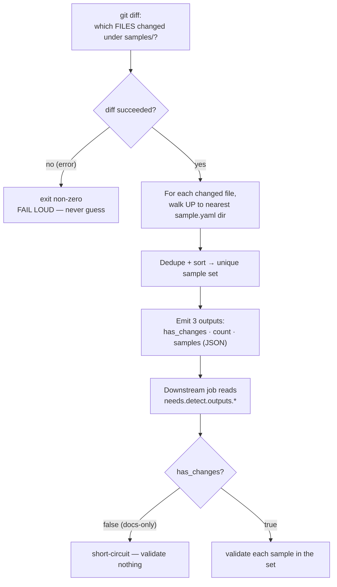

# How the changed-sample detector works

Companion doc for [`detect-changed-samples.sh`](./detect-changed-samples.sh) — the in-job
step (P1.2 of the public-first validation pipeline) that answers one question for the
validation gate: **"which samples did this PR/push actually change?"** so we validate only
those, not every sample in the tree.

## The flow

## The five moves

1. **Diff** — `git diff <base> HEAD -- samples/`. Base is: an explicit `--base-ref`, else
   `origin/<target>` for PRs, else `HEAD~1` for push.
2. **Walk up** — a file matters only if it lives under a folder containing a `sample.yaml`.
   That marker file *defines* a sample; the loop climbs to the nearest one. Files with no
   `sample.yaml` above them (docs, shared infra) contribute nothing.
3. **Dedupe** — many changed files in one sample collapse to one entry; output is
   sorted and deterministic.
4. **Emit** — three values to three places: the run log (humans), `$GITHUB_OUTPUT` (the
   next job), and optionally disk via `--output-dir` (tests).
5. **Hand off** — a downstream job reads `needs.<detect-job>.outputs.*` and either
   short-circuits (empty) or validates the set.

## The one rule that matters most

**"I couldn't look" must never look like "nothing changed."** If the diff errors, the
script exits non-zero and stops — it refuses to emit an empty set. An empty set is only ever
produced by a diff that *succeeded* and genuinely found no sample touched. (This is the scar
from ADO 5247751 — a silent empty diff once let an unvalidated change through the gate.)

## The contract

| | |
|---|---|
| **Input** | samples root (`--samples-root`, default `samples`), a base ref (explicit `--base-ref` or derived from the GitHub event) |
| **Outputs** | `has_changes` (true/false) · `count` (int) · `samples` (JSON array of dirs) |
| **Exit code** | `0` = detection ran (set may be empty) · non-zero = couldn't run (never "nothing changed") |
| **Requires** | every sample directory has a `sample.yaml` — that's a hard contract, not a convention |

To be consumable as `needs.<job>.outputs.*`, the emitting step needs an `id`, **and** the job
must re-export the step outputs under its own `outputs:` block. Writing `$GITHUB_OUTPUT` alone
is necessary but not sufficient. See the `detect`→`consume` jobs in `scripts-selftest.yml` for the wiring.

## Known sharp edges (tracked, not blockers)

These are accepted characteristics of a faithful port of the frozen ADO `DetectChanges`
design — documented in-code in the "Known limitations" block above `resolve_base_ref`.

- **Base-ref selection** — two-dot PR diff (can over-validate when the target advances),
  `HEAD~1` on a multi-commit push (misses earlier commits), best-effort fetch (can pass on a
  stale ref). Tracked: ADO 5473511 —
  https://msdata.visualstudio.com/Vienna/_workitems/edit/5473511
- **Post-diff fail-loud coverage** — only the `git diff` stage is provably fail-loud today;
  the `sort`/`mktemp`/emit pipeline and exotic (control-char) filenames are the gap. Tracked:
  ADO 5473651 — https://msdata.visualstudio.com/Vienna/_workitems/edit/5473651

## Where it's proven

Scripts self-test workflow ([`../workflows/scripts-selftest.yml`](../workflows/scripts-selftest.yml),
`contents: read`, no secrets/OIDC), triggered on any PR touching `.github/scripts/**`: a hermetic
check harness ([`test/run-detect-tests.sh`](./test/run-detect-tests.sh)) proves the detection cases
plus the docs-only empty-set / `$GITHUB_OUTPUT` hygiene contract, and a real-runner `detect`→`consume`
job proves a changed-sample payload flows through `needs.*.outputs` uncorrupted.

## Related

- Port source: the private ADO `validation.yml` **`DetectChanges`** stage.
- Parent work item: ADO 5449686 — https://msdata.visualstudio.com/Vienna/_workitems/edit/5449686
