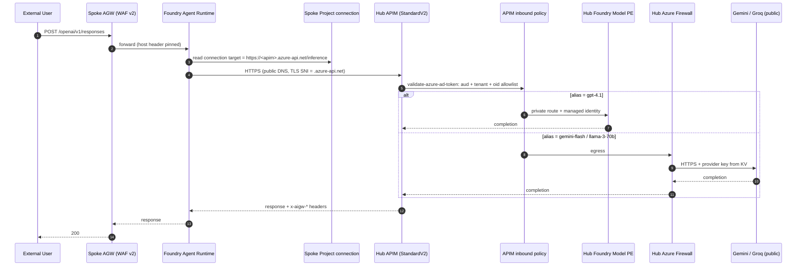

# Microsoft Foundry: Bring Your Own Model — Platform + LOB Operating Model (Terraform)

> **Status:** Scenario draft. This sample refactors [`46-bring-your-own-models`](../46-bring-your-own-models/README.md)
> to lead with the enterprise platform/LOB separation of concern. The v1 target
> is defined below (locked network topology + SKU choices); Terraform will land
> in a follow-up update. This document exists to align stakeholders on the
> shape, the boundaries, and the SKU/cost implications before code is written.
>
> **What's locked (v1 target):**
> 1. Two decoupled Terraform roots — `hub/` (platform-owned) and `spoke/` (LoB-owned).
> 2. A third small `03-network-registration/` root that owns the cross-subscription VNet peering pair, so neither hub nor spoke reads the other's state.
> 3. APIM **Standard v2** with a private endpoint into the hub VNet. Public network access on APIM is **Enabled** in v1 (with JWT + `oid` allowlist + optional IP allowlist as compensating controls) — see **Runtime posture note** below.
> 4. **Azure Firewall** as the single outbound path from the hub to external model providers.
> 5. **Application Gateway (WAF v2)** in each spoke as the *only* public surface — it fronts the agent runtime.
> 6. Foundry account in the spoke with **PNA (Public Network Access) disabled**; agents reach APIM through the Foundry project's `ApiManagement` connection published in `04-hub-workload`'s contract.
> 7. **Azure Bastion** in the hub as the operator/developer path into private resources.
> 8. Azure Policy at LoB scope (in addition to RBAC) as the model-admission guardrail.

## Runtime posture note — APIM PNA=Enabled (v1)

The Foundry Agents runtime (`POST {project}/openai/v1/responses`) executes on Microsoft-managed public compute. When the project's `ApiManagement` connection points at a target the runtime cannot reach, invocation fails with `SSL connection could not be established`. Two ways to give the runtime a path:

- **Option A (v1, adopted).** Leave the APIM private endpoint in place, and keep `publicNetworkAccess = Enabled` on the APIM service. The connection target uses the **public** hostname `<apim>.azure-api.net` (the managed TLS cert does **not** cover `privatelink.azure-api.net`, so using the privatelink hostname breaks TLS SNI). From inside the VNet, DNS still resolves privately via the `privatelink.azure-api.net` zone; from outside, DNS resolves to APIM's public IP. Authorization is enforced by the APIM `validate-azure-ad-token` policy — tenant + audience + `oid` allowlist. Optional compensating control: an inbound IP restriction to the `AzureCloud.<region>` service tag.
- **Option B (deferred).** Enable Foundry **Standard Agent Setup** with `networkInjections` on the Foundry account so the agent runtime executes inside a delegated subnet in the spoke VNet. This restores the "private everywhere" posture but adds delegated-subnet, BYO Storage/Search/Cosmos, and additional identity plumbing. Tracked as follow-up.

**Where this shows up in the code.**
- `04-hub-workload/locals.tf` sets the contract `apim_gateway_target` to the `.azure-api.net` hostname.
- `04-hub-workload/apim.tf` publishes APIM with `public_network_access_enabled = true` (kept on by an `azapi_update_resource` that flips it back if drift occurs).
- `06-hub-allowlist/apim-policy.xml.tftpl` carries the `validate-azure-ad-token` `oid` allowlist that gates every call.

## Architecture — v1 target (networked)

```text
                       External Model Providers (public HTTPS)
                       Google Gemini  ·  Groq (Llama)
                                     ▲
                                     │  Egress FROM HUB ONLY.
                                     │  FQDN allowlist on Azure Firewall.
                                     │  Provider keys retrieved from Key Vault.
   ╔═════════════════════════════════╪════════════════════════════════════════════╗
   ║   Sub A — Platform / Hub        │                  Owner: Platform Admin     ║
   ║                                                                              ║
   ║   ┌────────────────────────── Hub VNet ─────────────────────────────────┐    ║
   ║   │                                                                     │    ║
   ║   │  ┌──────────────┐   ┌──────────────────────────┐                    │    ║
   ║   │  │ Azure        │◄──│ Azure API Management     │                    │    ║
   ║   │  │ Firewall     │   │ (Standard v2)            │                    │    ║
   ║   │  │              │   │  • PNA = Enabled (v1)    │                    │    ║
   ║   │  │  FQDN allow: │   │  • Private endpoint too  │                    │    ║
   ║   │  │   Gemini,    │   │  • Managed cert covers   │                    │    ║
   ║   │  │   Groq       │   │    <name>.azure-api.net  │                    │    ║
   ║   │  │              │   │  • Policy: JWT+oid,      │                    │    ║
   ║   │  │              │   │    quota, catalog, logs  │                    │    ║
   ║   │  └──────────────┘   └──────┬────────┬──────────┘                    │    ║
   ║   │                            │        │                               │    ║
   ║   │   ┌────── Private ─────────┘        └─────── Private ───────┐       │    ║
   ║   │   │       Endpoint                          Endpoint        │       │    ║
   ║   │   ▼                                                          ▼      │    ║
   ║   │  Foundry MODEL account                             Azure Key Vault  │    ║
   ║   │   • gpt-4.1                                         gemini-api-key  │    ║
   ║   │   • PNA = Disabled                                  groq-api-key    │    ║
   ║   │                                                                     │    ║
   ║   │                                    ┌──────────────────┐             │    ║
   ║   │                                    │ Azure Bastion    │◄──── Ops    │    ║
   ║   │                                    │ (operator path)  │      access │    ║
   ║   │                                    └──────────────────┘             │    ║
   ║   │                                                                     │    ║
   ║   │   Log Analytics (public plane, RBAC-controlled — sink for APIM,     │    ║
   ║   │   Firewall, App Gateway diagnostics)                                │    ║
   ║   │                                                                     │    ║
   ║   │   Private DNS Zones (linked to Hub VNet + all Spoke VNets):         │    ║
   ║   │     privatelink.azure-api.net                                       │    ║
   ║   │     privatelink.openai.azure.com                                    │    ║
   ║   │     privatelink.cognitiveservices.azure.com                         │    ║
   ║   │     privatelink.vaultcore.azure.net                                 │    ║
   ║   └────────────────────────────┬────────────────────────────────────────┘    ║
   ║                                │                                             ║
   ╚════════════════════════════════╪═════════════════════════════════════════════╝
                                    │
                          ══════ Trust boundary ══════
                          Cross-sub VNet peering, bidirectional.
                          Managed by `03-network-registration/` root
                          so neither hub nor spoke owns both sides.
                                    │
   ╔════════════════════════════════╪═════════════════════════════════════════════╗
   ║   Sub B — LoB / Spoke          │                    Users: Agent Developers  ║
   ║                                                                              ║
   ║   ┌────────────────────────── Spoke VNet ────────────────────────────────┐   ║
   ║   │                                                                      │   ║
   ║   │  Public                                                              │   ║
   ║   │  users ──► ┌───────────────────────┐                                 │   ║
   ║   │  (HTTPS)   │ Application Gateway   │  ◄── ONLY public surface        │   ║
   ║   │            │  (WAF v2, WAF policy) │      of this whole system       │   ║
   ║   │            │  public listener      │                                 │   ║
   ║   │            └──────────┬────────────┘                                 │   ║
   ║   │                       │                                              │   ║
   ║   │                       ▼                                              │   ║
   ║   │            ┌───────────────────────────────────────────────────┐     │   ║
   ║   │            │ Foundry AGENT account (PNA = Disabled)            │     │   ║
   ║   │            │  private endpoint into Spoke VNet                 │     │   ║
   ║   │            │                                                   │     │   ║
   ║   │            │  ┌─────────────────────┐  ┌─────────────────────┐ │     │   ║
   ║   │            │  │ Project Alpha       │  │ Project Beta        │ │     │   ║
   ║   │            │  │  System-assigned MI │  │  System-assigned MI │ │     │   ║
   ║   │            │  │  capability host    │  │  capability host    │ │     │   ║
   ║   │            │  │  ApiManagement conn │  │  ApiManagement conn │ │     │   ║
   ║   │            │  │  → APIM private URL │  │  → APIM private URL │ │     │   ║
   ║   │            │  │                     │  │                     │ │     │   ║
   ║   │            │  │  Approved catalog:  │  │  Approved catalog:  │ │     │   ║
   ║   │            │  │   • gpt-4.1         │  │   • gpt-4.1         │ │     │   ║
   ║   │            │  │   • gemini-flash    │  │   • gemini-flash    │ │     │   ║
   ║   │            │  │   • llama-3-70b     │  │   • llama-3-70b     │ │     │   ║
   ║   │            │  └─────────┬───────────┘  └─────────┬───────────┘ │     │   ║
   ║   │            └────────────┼────────────────────────┼─────────────┘     │   ║
   ║   │                         │                        │                   │   ║
   ║   │                         └──── data proxy ────────┘                   │   ║
   ║   │                                (capability host)                     │   ║
   ║   │                                       │                              │   ║
   ║   │                                       │  outbound to APIM's          │   ║
   ║   │                                       │  private IP over peer        │   ║
   ║   │                                       ▼                              │   ║
   ║   │                              (goes back up to Hub VNet via peering)  │   ║
   ║   │                                                                      │   ║
   ║   │  Guardrails on this subscription:                                    │   ║
   ║   │    RBAC          : Foundry User on assigned project (developer)      │   ║
   ║   │    Azure Policy  : Foundry model-admission policy — deny non-        │   ║
   ║   │                    approved model deployments (belt to RBAC's        │   ║
   ║   │                    suspenders; even Contributor cannot bypass)       │   ║
   ║   └──────────────────────────────────────────────────────────────────────┘   ║
   ║                                                                              ║
   ╚══════════════════════════════════════════════════════════════════════════════╝
```

### Traffic flow (permitted)

1. **External user → Spoke Application Gateway** (public HTTPS on WAF v2 listener; the only public entry into the system for the AGW-fronted surface).
2. **App Gateway → Foundry agent account** (private-only, via Spoke VNet). The agent account's data plane is `<name>.services.ai.azure.com`, PE-resolved inside the spoke.
3. **Foundry Agents runtime → APIM.** The runtime executes on Microsoft-managed compute and calls out to the connection target from the project's `ApiManagement` connection — `https://<apim>.azure-api.net/inference`. In v1 with APIM `PNA = Enabled`, that URL resolves publicly and TLS SNI matches the managed cert. APIM's inbound `validate-azure-ad-token` policy pins tenant + audience + `oid` allowlist.
4. **APIM → backend** based on alias:
   - `gpt-4.1` → Foundry MODEL account's private endpoint inside the Hub VNet (managed-identity auth).
   - `gemini-flash` / `llama-3-70b` → Azure Firewall → FQDN-allowlisted public HTTPS to Google / Groq (provider key retrieved by APIM from Key Vault via KV private endpoint).
5. **APIM → Log Analytics** for unified per-request telemetry (`x-aigw-project-id`, `x-aigw-model-alias`, `x-aigw-vendor`, tokens).

### Traffic flow (denied by design)

- ❌ Foundry projects, agent accounts, and model accounts have PNA disabled — no direct public plane access to model or agent surfaces.
- ❌ Spoke has no outbound path to the internet for model traffic. Egress to Gemini/Groq happens **only** from the Hub firewall.
- ❌ Developers cannot deploy new model deployments in the spoke — RBAC hides the surface *and* Azure Policy denies at ARM (S1's empty allowlist).
- ❌ Callers without an approved `oid` in the APIM allowlist are rejected at the APIM edge, regardless of tenant.
- ❌ Neither hub nor spoke Terraform state reads or writes the other; the peering pair is owned by a third root.

### Request flow diagram



_Inside-VNet callers (e.g. the jumpbox in `08-spoke-jumpbox`) resolve the same `.azure-api.net` FQDN via the `privatelink.azure-api.net` DNS zone to APIM's private endpoint IP — same URL, private path._

## Delta from sample 46 (what will change)

Sample 46 puts platform (hub) and LOB (spokes) inside one Terraform root, uses public endpoints for APIM and Foundry, and relies on RBAC alone for the developer guardrail. This sample changes:

| # | Change | Rationale |
|---|---|---|
| 1 | Split Terraform into hub and spoke roots with independent state, pipelines, and identities. Add `03-network-registration/` root for the cross-sub peering pair. | Platform team and LOB teams have different release cadences and blast radiuses; neither should be in the other's state. |
| 2 | APIM **Standard v2** with a private endpoint into the hub VNet. Public network access remains **Enabled** in v1 so the MS-managed Foundry Agents runtime can reach the gateway; JWT + `oid` allowlist + optional IP allowlist compensate. Option B (Foundry `networkInjections`) is the follow-up path to a fully private posture. | Removes almost all public surface for the model layer; the remaining public listener is tightly authenticated. |
| 3 | **Azure Firewall** with an FQDN allowlist as the only outbound path to external providers. | Governance — every external model call is logged and controllable at the hub. |
| 4 | Foundry account **PNA = Disabled**; project uses an **`ApiManagement` connection** (`authType = ProjectManagedIdentity`, `deploymentInPath = true`) to call APIM's `.azure-api.net` hostname so TLS SNI matches APIM's managed certificate. | Cleaner than delegated-subnet network injection; no BYO storage/search dependencies. |
| 5 | **Application Gateway (WAF v2)** in each spoke as the sole public surface. | Makes "spoke exposes agents to the public, and nothing else" explicit. |
| 6 | **Azure Bastion** in the hub for operator access. | Portal + `az` operations against private planes need a private path. |
| 7 | Assign built-in **"Foundry model deployments should only use approved models"** Azure Policy at LoB scope. | RBAC alone lets Contributor bypass model admission; policy denies at ARM. |

## SKU and cost implications (v1 target)

| Component | SKU choice | Cost band | Notes |
|---|---|---|---|
| APIM | Standard v2 (1 unit) | ~$700–900/mo | Chosen over Premium (~$3k/mo); private endpoint + JWT/oid allowlist gives us the "private + authenticated" story at a fraction of the cost. |
| Azure Firewall | Standard | ~$900/mo + $0.016/GB | Basic tier lacks features needed here; Premium adds IDPS which we don't need for the sample. |
| Application Gateway | WAF v2, 1 instance | ~$250/mo per spoke | Per LoB. |
| Azure Bastion | Standard | ~$140/mo | Per hub. |
| Log Analytics | Pay-as-you-go | ingestion-based | Unchanged from sample 46. |
| Key Vault + Private Endpoints | standard | negligible | ~$0.30/mo per PE. |
| **Approximate v1 total** | | **~$2,000–2,500/mo** | Before token burn and per-LoB spoke additions. |

Sample 46 runs at roughly $600/mo for the same underlying inference story on public endpoints — the delta is what "private everywhere + Firewall + WAF + Bastion" costs, not what Foundry itself costs.

## Azure Policy guardrails (in addition to RBAC)

RBAC decides *who* can call ARM. Policy decides *what shape* an ARM request may take. In this sample we layer both — RBAC keeps LoB developers to the Foundry User role, and policy denies the ARM verbs that RBAC alone can't reason about (model SKUs, instant-model surface, PNA flips, non-APIM connections).

**Assignment scope (v1 target).** Subscription scope for the hub and subscription scope for the spoke. In the demo environment both planes share a subscription (so peers can keep using it for other testing) and the assignments land at the hub RG and spoke RG respectively. The README, samples, and diagrams all talk about it as "subscription scope" because that is the correct production scope; management-group scope is called out as the recommended production upgrade.

**Effect.** All policies below ship as `Deny`. This is a demo sample where the point is to *show* the guardrail firing; an `Audit` posture would hide the story. Production landing zones typically start with `Audit`, promote to `Deny` after a soak period.

### Hub policies (platform-owned)

Intent: the hub is the *only* place models exist. Keep that surface tight and auditable.

| # | Policy | Type | What it enforces | Effect |
|---|--------|------|------------------|--------|
| H1 | Foundry model deployments should only use approved models | Built-in | Allowlist on `Microsoft.CognitiveServices.Data/accounts/deployments` — `allowedPublishers` (e.g. `["Microsoft"]`) matched on `model.publisher`, plus `allowedAssetIds` substring-matched on `model.assetId`. Empty both ⇒ deny all. | Deny |
| H2 | Restrict deployment SKU on Foundry accounts | Custom | `Microsoft.CognitiveServices/accounts/deployments/sku.name` ∈ { `GlobalStandard`, `DataZoneStandard` } — blocks PTU / Batch / DeveloperTier unless explicitly requested | Deny |
| H3 | Foundry accounts must have `publicNetworkAccess = Disabled` | Custom | `Microsoft.CognitiveServices/accounts` — `properties.publicNetworkAccess == "Disabled"` | Deny |
| H4 | Foundry accounts must disable local (key) authentication | Custom | `Microsoft.CognitiveServices/accounts` — `properties.disableLocalAuth == true`, forcing AAD / managed identity | Deny |
| H5 | APIM must be Standard v2 with VNet integration | Custom | `Microsoft.ApiManagement/service` — `sku.name == "StandardV2"` AND `virtualNetworkType ∈ { "External", "Internal" }` | Deny |
| H6 | Diagnostic settings required on APIM and Foundry account | Built-in | Routes logs/metrics to the platform Log Analytics workspace | DeployIfNotExists |

### Spoke policies (LoB-scoped)

Intent: LoB developers get zero ability to bypass APIM. Foundry projects in the spoke are *consumers only* — no local models, no direct provider connections, no public data plane.

| # | Policy | Type | What it enforces | Effect |
|---|--------|------|------------------|--------|
| S1 | Foundry model deployments should only use approved models — empty allowlist | Built-in | Same built-in as H1, but `allowedPublishers = []` and `allowedAssetIds = []` → *nothing* deploys in the spoke | Deny |
| S2 | *(Deferred)* Disable instant-model access on every Foundry account | — | Intended to force `properties.instant.modelAllowList = []` per the [instant-models enterprise controls](https://learn.microsoft.com/azure/foundry/concepts/instant-models#enterprise-controls). The ARM alias `Microsoft.CognitiveServices/accounts/instant.modelAllowList` is not yet registered, so this policy cannot be authored today. S1's empty publisher + assetId lists already deny every spoke model deploy, which achieves the practical outcome until the alias ships. | *Not deployed* |
| S3 | Spoke Foundry projects must have PNA = Disabled | Custom | `Microsoft.CognitiveServices/accounts` — `properties.publicNetworkAccess == "Disabled"` on the agent account | Deny |
| S4 | Foundry project connections must be APIM-only | Custom | Inspect `Microsoft.CognitiveServices/accounts/projects/connections` — `properties.category ∈ { "ApiManagement", "CustomKeys" }` referencing the hub APIM; deny direct `AzureOpenAI`, `Serverless`, `CognitiveServices` | Deny |
| S5 | Only App Gateway–attached public IPs allowed | Custom | `Microsoft.Network/publicIPAddresses` must be attached to `Microsoft.Network/applicationGateways`; every other public IP request is denied | Deny |
| S6 | Every subnet must have an NSG association | Built-in | Standard LZ hygiene | Deny |
| S7 | Data plane services (Storage, Key Vault, Cosmos) must have `publicNetworkAccess = Disabled` | Built-in initiative | Keeps agent state private | Deny |
| S8 | Allowed locations for the spoke | Built-in | Pins spoke to the region negotiated with the hub (e.g. `swedencentral`) | Deny |
| S9 | Diagnostic settings to LoB Log Analytics | Built-in | Agent traces stay with the LoB — hub does not see LoB business data | DeployIfNotExists |

### Why policy strengthens RBAC (not replaces it)

| Scenario RBAC alone can't cleanly stop | Policy that closes it |
|---|---|
| A user has `Cognitive Services Contributor` (or drifts into it) and tries to create a Foundry model deployment in the spoke | **S1** — allowlist is empty, ARM rejects |
| Instant-model surface enabled at account level so calls succeed even without a deployment | *Not currently covered* — the `instant.modelAllowList` ARM alias isn't registered yet, so no Policy can set it. S1's empty allowlist blocks the underlying deploys today; a Modify-effect S2 will slot in once the alias ships. |
| Someone flips `publicNetworkAccess` back on a spoke Foundry account "to make it work" | **S3** — ARM rejects the write |
| A developer adds an `AzureOpenAI` connection pointing directly at a hub-owned model, bypassing APIM policies (token limits, routing, logging) | **S4** — connection category is not in the allowlist |
| A stray public IP appears next to the App Gateway | **S5** — public IP not attached to an AGW is denied |
| Someone deploys a `Batch` or `DeveloperTier` SKU in the hub to sidestep the hub's per-token limits | **H2** — hub SKU allowlist rejects it |
| A hub account is created with `disableLocalAuth = false`, leaving key auth open | **H4** — ARM rejects |

The built-in Foundry deployment policy (H1/S1) and the deployment-SKU restriction (H2) both follow the pattern documented in [Restrict deployment types with Azure Policy](https://learn.microsoft.com/azure/foundry/foundry-models/concepts/deployment-types#restrict-deployment-types-with-azure-policy) — this sample simply parameterises the SKU list and the model allowlist per plane.

## Operating rhythm — who runs what, and how often

The separation-of-concern story only lands if the demo shows *different actors, running different pipelines, on different cadences*. This is the sequence the sample will demo (using `terraform` commands from a laptop or Bastion — the same shape a pipeline would run).

| # | Actor | Action | State touched | When to run |
|---|---|---|---|---|
| 1a | Admin | Hub base pipeline — VNet, Firewall, Bastion, private DNS, **H-series policy** | `01-hub-base/` | **One-time** at hub bring-up. Re-run only when hub network topology or hub policy set changes. |
| 1b | Admin | Spoke base pipeline — VNet, AGW, NSGs, **S-series policy** | `02-spoke-base/` | **Once per LoB / per environment.** Re-run when a new LoB onboards or when S-series policy set changes. |
| 1c | Admin | Network-registration pipeline — peering pair, DNS zone links | `03-network-registration/` | **Once per (hub, spoke) pair.** Re-run only when a new spoke is added or an address space changes. |
| 2 | Admin | Hub workload pipeline — Foundry account, model deployments, APIM, KV, provider connections | `04-hub-workload/` | **Any time the model catalog changes** — new model published, model retired, provider key rotated, APIM policy edited. Expected cadence: monthly-ish. |
| 3 | App team | Spoke workload pipeline (phase 1) — Foundry project, agent MI. Outputs MI OID. | `05-spoke-workload-project/` | **Once per project** at project creation. Re-run only if the project MI is rebuilt. |
| 4 | App team | PR: add MI OID to `06-hub-allowlist/allowlist.auto.tfvars` | git | **Once per project** immediately after step 3. Also on MI rotation. |
| 5 | Admin | Reviews + merges PR | git | **On demand** — same cadence as step 4. Governance gate. |
| 6 | Admin | Hub apply — APIM validate-jwt allowlist updated | `06-hub-allowlist/` | **After every merge of an allowlist PR.** Fast, targeted apply (APIM policy only). |
| 7 | App team | Spoke workload pipeline (phase 2) — agent + AGW backend wiring | `07-spoke-workload-agent/` | **Any time the agent definition changes** — new agent, new tool, instruction update, model alias swap. Highest cadence in the whole flow (daily / per-PR). |
| 7a | *(optional)* | LoB tries to deploy a raw model → policy denies | — | **Demo only.** Not part of steady-state ops. Included to show the guardrail firing. |
| 8 | End user | Hits AGW public IP → agent → APIM → model | runtime | **Continuous.** No pipeline. |

**Cadence summary.**

- **One-time bring-up:** 1a, 1b, 1c.
- **Platform-owned, low frequency:** 2 (catalog changes), 6 (allowlist changes).
- **LoB-owned, high frequency:** 7 (agent iteration — where the LoB team lives day-to-day).
- **Governance handshake:** 3 → 4 → 5 → 6, once per project onboarding.

## Deferred to a follow-up sample (kept out of scope on purpose)

- **API Center** as design-time inventory for APIs, MCP servers, and agents.
- **Chargeback / quota telemetry** pipelines (Cosmos usage DB, Logic App aggregation — Citadel-style).
- **Managed Redis semantic cache** in front of APIM.
- **PII redaction** in the APIM inbound policy (Azure AI Language integration).
- **Cross-region resiliency** — this sample is single-region.
- **Persistent capability-host stores** (Storage / AI Search / Cosmos wired to the project capability host for thread persistence + vector search).
- **TLS on App Gateway.** The demo listener is HTTP:80 with a host header of the AGW's default `*.cloudapp.azure.com` FQDN. Production uses HTTPS + a Key-Vault-referenced cert.

## Getting started — apply order

All seven roots are built and validated. Each root has its own `terraform.tfvars.example`. Copy to `terraform.tfvars`, fill in subscription / tenant / any secrets, then `terraform init && terraform apply` in the order below.

| # | Root | Who | When |
|---|------|-----|------|
| 1a | `01-hub-base/` | Platform admin | Once |
| 1b | `02-spoke-base/` | Platform admin | Once per LoB / environment |
| 1c | `03-network-registration/` | Platform admin | Once per LoB (after 1a + 1b) |
| 2  | `04-hub-workload/` | Platform admin | Any time the model catalog changes |
| 3  | `05-spoke-workload-project/` | LoB app team | Once per project (after 1c + 2) |
| 4  | *PR to* `06-hub-allowlist/allowlist.auto.tfvars` | LoB app team | After each new project or MI rotation |
| 5  | *Review + merge PR* | Platform admin | Approval gate |
| 6  | `06-hub-allowlist/` | Platform admin | After every merge of an allowlist PR |
| 7  | `07-spoke-workload-agent/` | LoB app team | Every agent create / update |
| 8  | *Invoke* `terraform output -raw public_endpoint_url` | End user | Runtime |

Notes:

- Steps 1a, 1b, 2 write local state files that downstream roots consume via `terraform_remote_state`; keep the tree checked out so paths line up.
- Between step 2 and the first step 6, the APIM inference API has **no policy** attached. That is safe because the private endpoint isn't reachable from anywhere yet — no spoke exists. The first step 6 attaches the policy.
- Step 3 emits `project_managed_identity_object_id`. That value is the entire diff a step-4 PR makes to `allowlist.auto.tfvars`.
- Steps 4 and 5 aren't Terraform commands — they are a GitHub PR + review. Everything else is `terraform apply`.
- `02-spoke-base/app-gateway.tf` deliberately uses `lifecycle.ignore_changes` on the AGW's backend / listener / rule / probe / settings so `07-spoke-workload-agent` can patch those in via `azapi_update_resource` without state conflict.

## Open questions still to close

Locked already: SKU (Standard v2), egress control (Firewall), spoke ingress (App Gateway WAF v2), agent private path (capability host / data proxy), peering ownership (third root), operator access (Bastion).

Still open:

1. **Contract mechanism between hub and spoke.** File-based JSON (proposed) vs. `terraform_remote_state` vs. Azure App Config. File-based is simplest for a sample.
2. **Allowlist handshake (LoB MI OID → APIM allowlist).** PR-driven update to a hub-owned tfvars file (proposed) vs. a pipeline.
3. **Contract payload shape.** Minimum: gateway URL (private), audience, catalog aliases, allowed project MI OIDs. Anything else?

**Closed since last revision:**

- *Policy assignment scope.* Subscription scope (hub subscription for H-series, LoB subscription for S-series). Demo environment lands assignments at the RG scope because hub and spoke share a subscription in dev; docs and diagrams talk about it as subscription scope because that is the correct production shape. Management-group scope is the recommended production upgrade path.
- *Policy effect posture.* All policies ship as `Deny` so the demo can *show* the guardrail firing. Production landing zones typically start with `Audit` and promote to `Deny` after a soak period.

## Planned repository layout

One root per row in the operating rhythm — each root has a single cadence, a single blast radius, and a single owner. This is what lets step 6 be a 20-second apply and step 7 stay fast for the app team.

```text
47-bring-your-own-models-platform-lob/
  README.md                            ← this file

  01-hub-base/                         ← step 1a  (admin, one-time)
    versions.tf providers.tf variables.tf
    network.tf                         ← VNet, subnets, private DNS zones, peering-ready
    firewall.tf                        ← Azure Firewall + policy (FQDN allowlist to providers)
    bastion.tf
    policy-hub.tf                      ← H-series Azure Policy assignments
    log-analytics.tf                   ← platform LAW
    outputs.tf                         ← hub VNet id, subnet ids, LAW id, DNS zone ids

  02-spoke-base/                       ← step 1b  (admin, once per LoB)
    versions.tf providers.tf variables.tf
    network.tf                         ← spoke VNet, subnets, NSGs
    app-gateway.tf                     ← AGW WAF v2 + public IP (only public surface)
    policy-spoke.tf                    ← S-series Azure Policy assignments
    log-analytics.tf                   ← LoB LAW
    outputs.tf                         ← spoke VNet id, subnet ids, AGW id

  03-network-registration/             ← step 1c  (admin, per (hub, spoke) pair)
    versions.tf providers.tf variables.tf
    peering.tf                         ← both sides of VNet peering (two-provider root)
    dns-zone-links.tf                  ← link private DNS zones to spoke VNet
    README.md                          ← handshake explanation

  04-hub-workload/                     ← step 2  (admin, monthly-ish)
    versions.tf providers.tf variables.tf
    foundry-account.tf                 ← model account, PNA=Disabled, PE into hub-base VNet
    model-deployments.tf               ← catalog: gpt, gemini, groq aliases
    key-vault.tf                       ← provider keys (PE)
    apim.tf apim-api.tf apim-named-values.tf   ← APIM Standard v2, VNet integration, PE
    contract.tf                        ← publishes contracts/hub-workload.contract.json
    outputs.tf                         ← APIM name, RG, API name, policy render inputs

  05-spoke-workload-project/           ← step 3  (app team, once per project)
    versions.tf providers.tf variables.tf
    foundry-account.tf                 ← agent account (PNA=Disabled) + PE
    project.tf                         ← project + system-assigned MI
    capability-host.tf                 ← data-proxy wiring
    connection.tf                      ← ApiManagement connection to contract's private URL
    outputs.tf                         ← project MI OID → carried into step 4 PR

  06-hub-allowlist/                    ← step 6  (admin, per-PR)
    versions.tf providers.tf variables.tf
    apim-policy.xml.tftpl              ← the actual XML policy body
    policy.tf                          ← renders + attaches it to the APIM API
    allowlist.auto.tfvars              ← the file the PR in step 4 edits
    README.md                          ← "PR-touch-this-file" instructions

  07-spoke-workload-agent/             ← step 7  (app team, daily / per-PR)
    versions.tf providers.tf variables.tf
    agent.tf                           ← agent definition, tools, instructions, model alias
    app-gateway-wiring.tf              ← azapi_update_resource patches AGW backend / listener / rule
    outputs.tf                         ← public URL

  contracts/                           ← non-secret published artifacts
    hub-workload.contract.json         ← gateway URL, audience, model aliases, catalog version
    README.md                          ← contract schema + versioning rules
```

### Root-to-rhythm mapping

| Root | Rhythm step | Cadence | Blast radius | Owner |
|---|---|---|---|---|
| `01-hub-base/` | 1a | One-time | Hub network + hub policy | Platform admin |
| `02-spoke-base/` | 1b | Once per LoB | Spoke network + spoke policy | Platform admin (LoB-scoped) |
| `03-network-registration/` | 1c | Once per (hub, spoke) pair | Peering + DNS zone links | Platform admin |
| `04-hub-workload/` | 2 | Monthly-ish | Model catalog + APIM config | Platform admin |
| `05-spoke-workload-project/` | 3 | Once per project | Foundry project + MI + APIM connection | App team |
| `06-hub-allowlist/` | 6 | Per allowlist PR | APIM `validate-jwt` claim list only | Platform admin (post-merge) |
| `07-spoke-workload-agent/` | 7 | Daily / per-PR | Agent definition + AGW wiring | App team |

### Contract flow (which file feeds which root)

```text
01-hub-base outputs
        │
        ▼
04-hub-workload (consumes 01-hub-base) ──► contracts/hub-workload.contract.json (published)
        │                                            │
        │                                            ▼
        │                                05-spoke-workload-project (consumes contract)
        │                                            │
        │                                            ▼
        │                                05-spoke-workload-project outputs (MI OID)
        │                                            │
        │                                            ▼
        │                                       step 4 PR
        │                                            │
        │                                            ▼
        ▼                                06-hub-allowlist/allowlist.auto.tfvars
06-hub-allowlist (consumes 04-hub-workload + tfvars)
```

Every arrow is a file a reviewer can point at. No root reads another root's state — the only cross-root data is (a) explicit outputs written to `contracts/`, and (b) the tfvars file edited via PR.

## References

- Sample 46 (single-root BYOM): [`../46-bring-your-own-models/README.md`](../46-bring-your-own-models/README.md)
- Azure API Center overview: https://learn.microsoft.com/azure/api-center/overview
- Foundry model deployment policies: https://learn.microsoft.com/azure/foundry/how-to/model-deployment-policy
- Restrict deployment types with Azure Policy: https://learn.microsoft.com/azure/foundry/foundry-models/concepts/deployment-types#restrict-deployment-types-with-azure-policy
- Instant models — enterprise controls: https://learn.microsoft.com/azure/foundry/concepts/instant-models#enterprise-controls
- API Management private networking: https://learn.microsoft.com/azure/api-management/ai-gateway-configure-private-networking
- Foundry Standard Agent + capability host networking: https://learn.microsoft.com/azure/foundry/agents/concepts/standard-agent-setup
