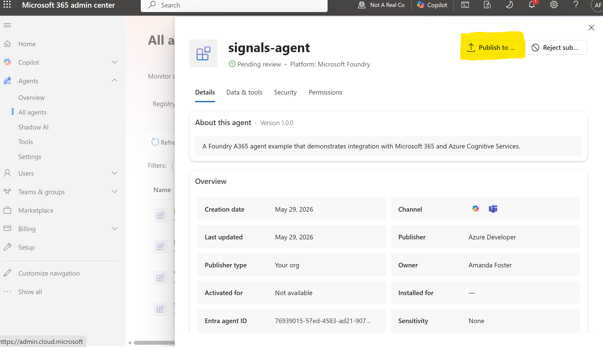

# 🤖 Foundry Autopilot Agent Example

> A minimal example of deploying a Foundry Autopilot agent with Azure Developer CLI

---

## 📋 Prerequisites

**Note:** You must be enrolled in the [Frontier preview program](https://adoption.microsoft.com/en-us/copilot/frontier-program/) to publish a Foundry agent as Autopilot.

Ensure you have the following installed:

| Requirement | Description |
|-------------|-------------|
| [Azure CLI](https://learn.microsoft.com/cli/azure/install-azure-cli) | Azure authentication and role management |
| [Azure Developer CLI](https://learn.microsoft.com/azure/developer/azure-developer-cli/install-azd) | Infrastructure deployment tool |
| [.NET 9.0 SDK](https://dotnet.microsoft.com/download) | Development framework |

### 🔐 Required Permissions

- **Owner** role on the Azure subscription
- **Foundry User** or **Cognitive Services User** role at subscription or resource group level
- Access to a Microsoft 365 administrator who can approve and activate the agent blueprint

---

## 🚀 Quick Start

### Step 1: Authenticate

Log in to your Azure tenant with Azure CLI and Azure Developer CLI:

```powershell
# Log in to Azure CLI
az login --tenant <tenant-id>

# Log in to Azure Developer CLI
azd auth login --tenant-id <tenant-id>
```

### Step 2: Deploy Everything

> **📍 Region availability:** This sample uses [Foundry hosted agents](https://learn.microsoft.com/en-us/azure/foundry/agents/quickstarts/quickstart-hosted-agent?pivots=azd). Your Foundry account and other resources must be in a region where hosted agents are available. At the time of writing, supported regions are:
>
> Australia East, Brazil South, Canada Central, Canada East, East US, East US 2, France Central, Germany West Central, Italy North, Japan East, Korea Central, North Central US, Norway East, Poland Central, South Africa North, South Central US, South India, Southeast Asia, Spain Central, Sweden Central, Switzerland North, UAE North, UK South, West Central US, West US, West US 3.

#### Optional: Customize Your Agent

Before deploying, you can customize:
- **Agent instructions:** [AgentInstructions.cs](./src/hello_world_a365_agent/AgentLogic/AgentInstructions.cs)
- **MCP tools:** [ToolManifest.json](./src/hello_world_a365_agent/ToolingManifest.json) - [Learn more](https://learn.microsoft.com/en-us/microsoft-agent-365/tooling-servers-overview)

#### Deploy

```powershell
azd provision
```

After deployment completes, inspect your resource values:

```powershell
azd env get-values
```

### Step 3: Tenant Admin Approves the Agent in Microsoft Admin Center

1. Navigate to the [Microsoft 365 admin center](https://admin.cloud.microsoft/?#/agents/all/requested)
2. Under **Requests**, locate your **agent blueprint**:
   

3. Click the **Approve request and activate** button to approve the blueprint:
   

### Step 4: Create Agent Instances

1. In Microsoft Teams, navigate to **Apps** → **Agents for your team**
2. Find your agent blueprint and create an instance:
   

---

## 🏗️ Architecture Overview

This deployment orchestrates four key components to create a fully functional Autopilot agent:

### 1️⃣ Creating a Foundry Project

Creates a Foundry project configured to support hosted agents with appropriate permissions on an Azure Container Registry for building and storing Docker images.

📚 [Learn more about prerequisites](https://github.com/microsoft/container_agents_docs?tab=readme-ov-file#11---prerequisites)

### 2️⃣ Building a Hosted Agent Docker Image

Compiles the sample code into a Docker container and registers it as a hosted agent with the Foundry project.

📚 [Learn more about building agents](https://github.com/microsoft/container_agents_docs?tab=readme-ov-file#14---build-agent-image)

### 3️⃣ Creating the Agent

Creates the hosted agent using the Docker image above.

📚 [Learn more about agent deployment](https://github.com/microsoft/container_agents_docs?tab=readme-ov-file#step-2-deploy-agent)

### 4️⃣ Publishing to Your Organization

Publishes the agent to Microsoft 365 via Foundry


---

## 📜 Hosted Agent Logs

If you receive an error, the response will include a `FOUNDRY_AGENT_SESSION_ID`. Use it to stream the hosted agent's session logs:

```bash
eval "$(azd env get-values)"
export FOUNDRY_AGENT_SESSION_ID="<session-id-from-error-response>"
ACCESS_TOKEN="$(az account get-access-token --resource https://ai.azure.com --query accessToken -o tsv)"

curl -N \
  -H "Authorization: Bearer $ACCESS_TOKEN" \
  -H "Accept: text/event-stream" \
  -H "Cache-Control: no-cache" \
  -H "Foundry-Features: HostedAgents=V1Preview" \
  "https://$ACCOUNT_NAME.services.ai.azure.com/api/projects/$PROJECT_NAME/agents/$AGENT_NAME/sessions/$FOUNDRY_AGENT_SESSION_ID:logstream?api-version=2025-11-15-preview"
```

The agent also sends ASP.NET Core requests, outgoing HTTP dependencies, exceptions, and `ILogger` entries to Application Insights. Request correlation is preserved when `CloudAdapter` moves an activity to its background queue, so telemetry from `A365AgentApplication` shares the `/activity/messages` `operation_Id`. Foundry injects `APPLICATIONINSIGHTS_CONNECTION_STRING` into the hosted container. Set the same environment variable when running locally if you want local telemetry in Application Insights.

The Responses API invocation also emits an `invoke_agent <agentName>` span with `gen_ai.operation.name`, `gen_ai.agent.name`, a stable `<agentName>:<agentVersion>` in `gen_ai.agent.id` and `microsoft.gen_ai.main_agent.id`, input/output message envelopes, and the final `gen_ai.response.id`. The creation script supplies `FOUNDRY_PROJECT_ARM_ID` for `microsoft.foundry.project.id`; the runtime supplies the agent name, version, and session ID. The additional exporter listens only to this custom source, leaving the existing request and dependency collectors unchanged.

To verify an update, use the same sample directory and `azd` environment that you deployed. The session commands require the Foundry agent extension (`azd ext install azure.ai.agents` if it is not installed).

1. After `azd provision`, record the new agent version reported by deployment. Confirm in the Foundry portal that it is selected for new invocations; creating a version alone is not proof that traffic uses it.
2. Set the project endpoint and list the sessions:

   ```powershell
   $env:FOUNDRY_PROJECT_ENDPOINT = azd env get-value AZURE_AI_PROJECT_ENDPOINT
   $agentName = azd env get-value AGENT_NAME
   azd ai agent sessions list --agent-name $agentName --output json
   ```

   Find the session for your conversation and inspect its `agent_session_id`, `status`, and `version_indicator.agent_version`. If the response includes a continuation token, use `--pagination-token` to retrieve the next page. An existing session can still be using the previous version.
3. Stop only the session you intend to test:

   ```powershell
   azd ai agent sessions stop "<session-id>" --agent-name $agentName
   ```

   Stopping interrupts running work but preserves the logical session and its persistent filesystem. Do not delete the session to update its code. Coordinate with anyone using that instance before stopping it.
4. Send one message to the same instance in Teams to resume execution. Run the session-list command again and confirm the session now reports the intended version. If it does not, check the endpoint's selected version instead of assuming an idle timeout will fix it.
5. Allow telemetry ingestion, then run this query in the connected Application Insights resource's **Logs** view. Replace the agent name and version with the values you just verified:

   ```kusto
   let expectedAgentId = "<agent-name>:<version>";
   dependencies
   | where timestamp > ago(30m)
   | where name startswith "invoke_agent "
   | where tostring(customDimensions["gen_ai.agent.id"]) == expectedAgentId
   | project timestamp, name, type, success, operation_Id,
       agentId = tostring(customDimensions["gen_ai.agent.id"]),
       responseId = tostring(customDimensions["gen_ai.response.id"]),
       sessionId = tostring(customDimensions["azure.ai.agentserver.session_id"]),
       projectId = tostring(customDimensions["microsoft.foundry.project.id"])
   | order by timestamp desc
   ```

These custom `ActivityKind.Internal` spans land in `dependencies` as `InProc`. That is not a rule for every implementation: other span kinds or SDK integrations can use `requests`. The trailing space in `"invoke_agent "` distinguishes this application's spans from the platform's bare `invoke_agent` span. A successful reply or a platform span alone does not verify this instrumentation.

**Content capture:** the new invocation spans omit conversation text by default while retaining the message envelopes. To opt in deliberately, set `OTEL_INSTRUMENTATION_GENAI_CAPTURE_MESSAGE_CONTENT=true` in the `azd` environment and run `azd provision` to create an updated version, then repeat the session verification above. Setting it to `false` disables that capture. This setting is not an application-wide redaction switch: existing application logs, exceptions, and other SDKs can still contain sensitive data. Review logging, access, and retention before using real conversations.

---

## 📖 Additional Resources

- [Foundry Container Agents Documentation](https://github.com/microsoft/container_agents_docs)
- [Azure Developer CLI Documentation](https://learn.microsoft.com/azure/developer/azure-developer-cli/)
- [Agent Blueprint Configuration](https://dev.teams.microsoft.com/tools/agent-blueprint)

---

## 🤝 Support

For issues or questions, please refer to the official documentation or contact your Azure administrator.
