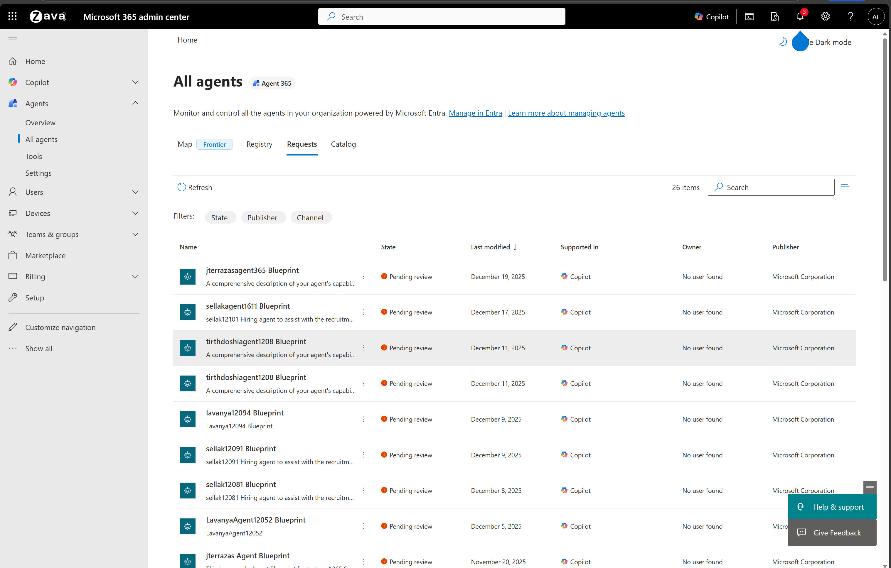
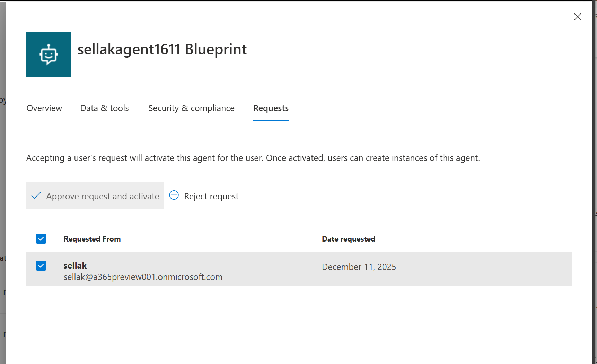
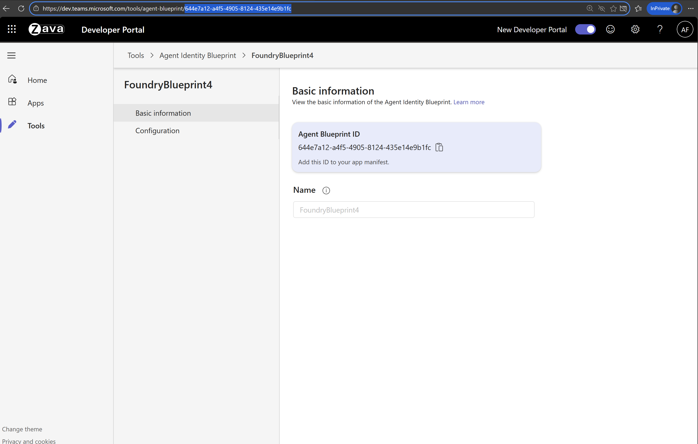
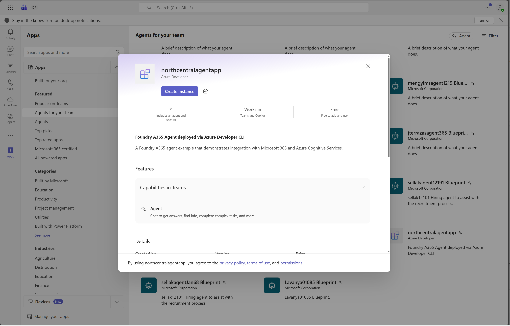

# 🤖 Foundry A365 Agent Example (Python)

> A minimal example of deploying a Foundry A365 agent with Azure Developer CLI — Python port of the [C# sample](../../csharp/foundry-ai-teammate/readme.md).

---

## 📋 Prerequisites

**Note:** You must be enrolled in the [Frontier preview program](https://adoption.microsoft.com/en-us/copilot/frontier-program/) to publish a Foundry agent to Microsoft Agent 365.

Ensure you have the following installed:

| Requirement | Description |
|-------------|-------------|
| [Azure Developer CLI](https://learn.microsoft.com/azure/developer/azure-developer-cli/install-azd) | Infrastructure deployment tool |
| [Python 3.11+](https://www.python.org/downloads/) | Runtime for the agent |
| [Docker](https://www.docker.com/) | Required for `azd provision` (image is built via ACR Tasks, but the Docker CLI must be present) |
| [PowerShell 7+](https://learn.microsoft.com/powershell/scripting/install/installing-powershell) | The `azd` post-provision hook uses PowerShell scripts |

### 🔐 Required Permissions

- **Owner** role on the Azure subscription
- **Foundry User** or **Cognitive Services User** role at subscription or resource group level
- **Tenant Admin** role for organization-wide configuration

---

## 🚀 Quick Start

### Step 1: Authenticate

Login to your Azure tenant and authenticate with Azure Developer CLI. Depending on your tenant's security settings, `az login` alone may be sufficient, or you may need to additionally sign in for the specific scopes used by the deployment scripts.

```powershell
# Login to Azure CLI
az login

# Login to Azure Developer CLI
azd auth login
```

### Step 2: Deploy Everything

> **📍 Region availability:** This sample uses [Foundry hosted agents](https://learn.microsoft.com/en-us/azure/foundry/agents/quickstarts/quickstart-hosted-agent?pivots=azd). Your Foundry account and other resources must be in a region where hosted agents are available. At the time of writing, supported regions are:
>
> Australia East, Brazil South, Canada Central, Canada East, East US, East US 2, France Central, Germany West Central, Italy North, Japan East, Korea Central, North Central US, Norway East, Poland Central, South Africa North, South Central US, South India, Southeast Asia, Spain Central, Sweden Central, Switzerland North, UAE North, UK South, West Central US, West US, West US 3.

#### Optional: Customize Your Agent

Before deploying, you can customize:
- **Agent instructions:** [`agent_instructions.py`](./src/hello_world_a365_agent/hello_world_a365_agent/agent_logic/agent_instructions.py)
- **MCP tools:** [`tooling_manifest.json`](./src/hello_world_a365_agent/tooling_manifest.json) — [Learn more](https://learn.microsoft.com/en-us/microsoft-agent-365/tooling-servers-overview)

#### Deploy

Ensure Docker is running, then execute:

```powershell
azd provision
```

After deployment completes, retrieve your resource values:

```powershell
azd env get-values
```

> **📌 What to expect after deployment:**
> After `azd provision` completes successfully, you will see the **AgentIdentityBlueprint** in the Agents registry. You will **not** see any agents in the requests tab yet. This is expected behavior — you must first approve the agent blueprint, configure it in Teams Developer Portal, and then create agent instances based on that blueprint.

### Step 3: Approve the Agent Blueprint

**Important:** The first step is to approve the **agent blueprint** itself. Agent instances will be created later in Step 5.

1. Navigate to the [Microsoft 365 admin center](https://admin.cloud.microsoft/?#/agents/all/requested)
2. Under **Requests**, locate your **agent blueprint**:
   

3. Click the **Approve request and activate** button to approve the blueprint:
   

### Step 4: Configure Teams Integration

After approving the agent blueprint, configure it in the Teams Developer Portal:

1. Open the [Teams Developer Portal](https://dev.teams.microsoft.com/tools/agent-blueprint) and locate your approved agent blueprint

   **Note:** Only 100 Agent Blueprints are displayed. If yours isn't visible, click any blueprint to open its details page, then in the browser's address bar replace the blueprint ID portion of the URL with your own Blueprint ID from the previous step (for example: `https://dev.teams.microsoft.com/tools/agent-blueprint/<your-blueprint-id>`).
   

2. Get your Blueprint ID:
   ```powershell
   azd env get-values
   ```

3. Navigate to **Configuration** and add your **Bot ID** (same as Blueprint ID):
   

### Step 5: Create Agent Instances

After configuring the agent blueprint in Teams Developer Portal, you can now create agent instances based on your blueprint:

1. In Microsoft Teams, navigate to **Apps** → **Agents for your team**
2. Find your agent blueprint and create an instance:
   

---

## 🏗️ Architecture Overview

This deployment orchestrates five key components to create a fully functional A365 agent — identical to the C# sample but with the agent implemented in Python.

### 1️⃣ Creating a Foundry Project

Creates a Foundry project configured to support hosted agents with appropriate permissions on an Azure Container Registry for building and storing Docker images.

📚 [Learn more about prerequisites](https://github.com/microsoft/container_agents_docs?tab=readme-ov-file#11---prerequisites)

### 2️⃣ Setting up Azure Bot Service

Azure Bot Service acts as a relay between M365 ecosystem interactions and the Foundry application. The bot is configured with:

- Agent endpoint
- Agent's blueprint identity as the appId

### 3️⃣ Building a Hosted Agent Docker Image

Compiles the sample code into a Docker container and registers it as a hosted agent with the Foundry project. The Python container is built directly via `pip install -r requirements.txt`; no compile step is required.

📚 [Learn more about building agents](https://github.com/microsoft/container_agents_docs?tab=readme-ov-file#14---build-agent-image)

### 4️⃣ Creating the Agent

Creates the hosted agent using the Docker image above.

📚 [Learn more about agent deployment](https://github.com/microsoft/container_agents_docs?tab=readme-ov-file#step-2-deploy-agent)

### 5️⃣ Publishing to Your Organization

Publishes the application to Microsoft 365 via Foundry API, creating a hireable digital worker with:

- Digital worker metadata
- Agent blueprint ID
- Digital worker designation

> **⚠️ Important:** The agent requires [admin approval](https://learn.microsoft.com/en-us/entra/identity/enterprise-apps/review-admin-consent-requests#review-and-take-action-on-admin-consent-requests-1) before becoming available for hiring.

---

## 🧱 Python Project Layout

```
src/hello_world_a365_agent/
├── pyproject.toml                          # Project metadata + dependencies
├── requirements.txt                        # Pinned runtime deps for Docker
├── appsettings.json                        # Config (also surfaced via env vars)
├── tooling_manifest.json                   # MCP server definitions
├── foundry-infra/Dockerfile                # Python container image
└── hello_world_a365_agent/                 # Python package
    ├── app.py                              # aiohttp entry point (Program.cs equivalent)
    ├── agent_logic/
    │   ├── a365_agent_application.py       # Activity routing (A365AgentApplication.cs)
    │   ├── agent_instructions.py           # Agent system instructions
    │   ├── agent_logic_service.py          # IAgentLogicService protocol
    │   └── responses_api/
    │       ├── responses_api_agent_logic_service.py        # Responses API client
    │       └── responses_api_agent_logic_service_factory.py# MCP discovery + DI
    ├── services/
    │   ├── agent_token_helper.py           # Three-step agentic token flow
    │   └── agent_token_credential.py       # Caching wrapper over the helper
    └── models/
        ├── agent_metadata.py
        └── mcp_server_config.py
```

The main runtime entry point is `python -m hello_world_a365_agent.app`. Inside the container, the Dockerfile sets that as the `ENTRYPOINT`.

## 🛠️ Local Development

```powershell
cd src/hello_world_a365_agent

# Create and activate a virtual environment
python -m venv .venv
.venv\Scripts\Activate.ps1   # macOS/Linux: source .venv/bin/activate

# Install the package + dependencies
pip install --upgrade pip
pip install --pre -r requirements.txt

# Set the same environment variables the Dockerfile sets when running in Foundry:
#   AzureOpenAIEndpoint, ModelDeployment, Connections__ServiceConnection__Settings__ClientId,
#   Connections__ServiceConnection__Settings__AuthorityEndpoint, FOUNDRY_AGENT_DEFAULT_INSTANCE_CLIENT_ID

python -m hello_world_a365_agent.app
```

The server listens on `http://0.0.0.0:8088` by default (override via `PORT`).

## 📜 Hosted Agent Logs

If you receive an error, the response will include a `FOUNDRY_AGENT_SESSION_ID`. Use it to stream the hosted agent's session logs:

```bash
curl -N \
  -H "Authorization: Bearer $TOKEN" \
  -H "Accept: text/event-stream" \
  -H "Cache-Control: no-cache" \
  -H "Foundry-Features: HostedAgents=V1Preview" \
  "https://$ACCOUNT_NAME.services.ai.azure.com/api/projects/$PROJECT_NAME/agents/$AGENT_NAME/sessions/$SESSION_NAME:logstream?api-version=2025-11-15-preview"
```

---

## 📖 Additional Resources

- [Foundry Container Agents Documentation](https://github.com/microsoft/container_agents_docs)
- [Azure Developer CLI Documentation](https://learn.microsoft.com/azure/developer/azure-developer-cli/)
- [Agent Blueprint Configuration](https://dev.teams.microsoft.com/tools/agent-blueprint)
- [Microsoft Agent 365 SDK - Python](https://github.com/microsoft/Agent365-python)
- [Microsoft 365 Agents SDK - Python](https://github.com/Microsoft/Agents-for-python)
- [A365 Python sample agents](https://github.com/microsoft/Agent365-Samples/tree/main/python)

---

## 🤝 Support

For issues or questions, please refer to the official documentation or contact your Azure administrator.
