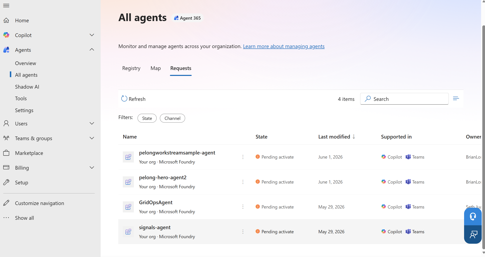

# 🤖 Foundry Autopilot Agent Example

> A minimal example of deploying a Foundry A365 agent with Azure Developer CLI

---

## 📋 Prerequisites

**Note:** You must be enrolled in the [Frontier preview program](https://adoption.microsoft.com/en-us/copilot/frontier-program/) to publish a Foundry agent to Microsoft Agent 365.

Ensure you have the following installed:

| Requirement | Description |
|-------------|-------------|
| [Azure Developer CLI](https://learn.microsoft.com/azure/developer/azure-developer-cli/install-azd) | Infrastructure deployment tool |
| [Python 3.11+](https://www.python.org/downloads/) | Agent runtime (built and packaged inside the Docker image) |
| [Docker](https://www.docker.com/products/docker-desktop/) | Required for the local ACR build step (or use `az acr build` directly) |

### 🔐 Required Permissions

- **Owner** role on the Azure subscription
- **Azure AI User** or **Cognitive Services User** role at subscription or resource group level

---

## 🚀 Quick Start

### Step 1: Authenticate

Login to your Azure tenant and authenticate with Azure Developer CLI. Depending on your tenant's security settings, `az login` alone may be sufficient, or you may need to additionally sign in for the specific scopes used by the deployment scripts.

```powershell
# Login to Azure CLI
az login

# Login to Azure Developer CLI
azd auth login
```

### Step 2: Deploy Everything

> **📍 Region availability:** This sample uses [Foundry hosted agents](https://learn.microsoft.com/en-us/azure/foundry/agents/quickstarts/quickstart-hosted-agent?pivots=azd). Your Foundry account and other resources must be in a region where hosted agents are available. At the time of writing, supported regions are:
>
> Australia East, Brazil South, Canada Central, Canada East, East US, East US 2, France Central, Germany West Central, Italy North, Japan East, Korea Central, North Central US, Norway East, Poland Central, South Africa North, South Central US, South India, Southeast Asia, Spain Central, Sweden Central, Switzerland North, UAE North, UK South, West Central US, West US, West US 3.

#### Optional: Customize Your Agent

Before deploying, you can customize:
- **Agent instructions:** [agent.py](./src/hello_world_a365_agent/agent.py) (the `AGENT_PROMPT` constant on `FoundryDigitalWorkerAgent`)
- **MCP tools:** [ToolingManifest.json](./src/hello_world_a365_agent/ToolingManifest.json) - [Learn more](https://learn.microsoft.com/en-us/microsoft-agent-365/tooling-servers-overview)

#### Deploy

Ensure Docker is running, then execute:

```powershell
azd provision
```

After deployment completes, retrieve your resource values:

```powershell
azd env get-values
```

> **📌 What to expect after deployment:**  
> After `azd provision` completes successfully, you will see the **AgentIdentityBlueprint** in the Agents registry. You will **not** see any agent instances yet. This is expected behavior - you must first approve the agent blueprint and then create instances based on it.

### Step 3: Approve the Agent Blueprint

**Important:** The first step is to approve the **agent blueprint** itself. Agent instances will be created in Step 4.

1. Navigate to the [Microsoft 365 admin center](https://admin.cloud.microsoft/?#/agents/all/requested)
2. Under **Requests**, locate your **agent blueprint**:
   

3. Click the **Approve request and activate** button to approve the blueprint:
   

### Step 4: Create Agent Instances

After approving the agent blueprint, you can create agent instances based on it:

1. In Microsoft Teams, navigate to **Apps** → **Agents for your team**
2. Find your agent blueprint and create an instance:
   

---

## 🏗️ Architecture Overview

This deployment orchestrates four key components to create a fully functional A365 agent:

### 1️⃣ Creating a Foundry Project

Creates a Foundry project configured to support hosted agents with appropriate permissions on an Azure Container Registry for building and storing Docker images.

📚 [Learn more about prerequisites](https://github.com/microsoft/container_agents_docs?tab=readme-ov-file#11---prerequisites)

### 2️⃣ Building a Hosted Agent Docker Image

Compiles the Python sample into a Docker container and registers it as a hosted agent with the Foundry project.

📚 [Learn more about building agents](https://github.com/microsoft/container_agents_docs?tab=readme-ov-file#14---build-agent-image)

### 3️⃣ Creating the Agent

Creates the hosted agent using the Docker image above. Foundry creates and manages the agent identity blueprint as part of this operation.

📚 [Learn more about agent deployment](https://github.com/microsoft/container_agents_docs?tab=readme-ov-file#step-2-deploy-agent)

### 4️⃣ Publishing to Your Organization

Publishes the application to Microsoft 365 via the Foundry API, creating a hireable autopilot agent with:

- Digital worker metadata
- Agent blueprint ID
- Autopilot designation

> **⚠️ Important:** An administrator must approve the agent before it becomes available for hiring.

---

## 📜 Hosted Agent Logs

If you receive an error, the response will include a `FOUNDRY_AGENT_SESSION_ID`. Use it to stream the hosted agent's session logs:

```bash
curl -N \
  -H "Authorization: Bearer $TOKEN" \
  -H "Accept: text/event-stream" \
  -H "Cache-Control: no-cache" \
  -H "Foundry-Features: HostedAgents=V1Preview" \
  "https://$ACCOUNT_NAME.services.ai.azure.com/api/projects/$PROJECT_NAME/agents/$AGENT_NAME/sessions/$SESSION_NAME:logstream?api-version=2025-11-15-preview"
```

---

## 📖 Additional Resources

- [Foundry Container Agents Documentation](https://github.com/microsoft/container_agents_docs)
- [Azure Developer CLI Documentation](https://learn.microsoft.com/azure/developer/azure-developer-cli/)
- [Agent Blueprint Configuration](https://dev.teams.microsoft.com/tools/agent-blueprint)

---

## 🤝 Support

For issues or questions, please refer to the official documentation or contact your Azure administrator.
