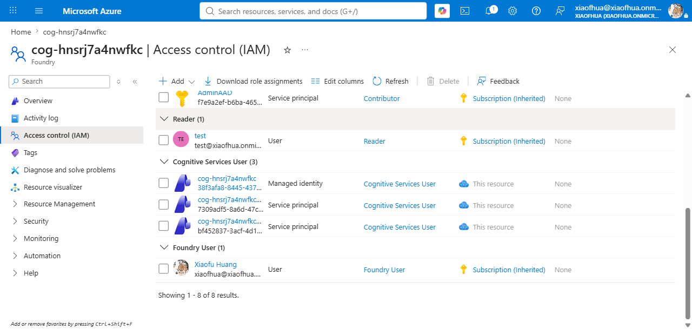
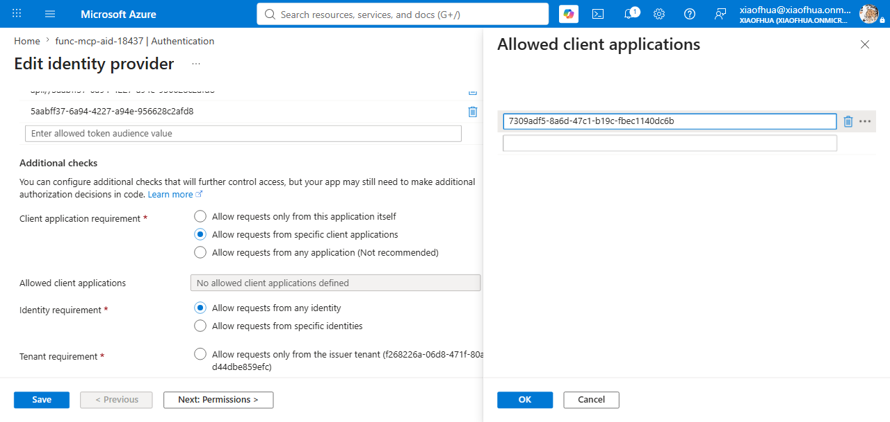

# MCP — Microsoft Entra (Agent Identity / Project Managed Identity)

Connect to an MCP server that accepts an **Entra ID token issued for a Foundry-managed identity**
(no user in the loop, no stored secret). Foundry acquires the token and presents it to the server;
you authorize the identity on the target server before the agent invokes it.

**Example servers:** [Azure Language MCP server](https://learn.microsoft.com/en-us/azure/ai-services/language-service/overview) (Microsoft Azure resource),
your own MCP (e.g. [Azure Functions](https://learn.microsoft.com/en-us/azure/azure-functions/functions-mcp-tutorial) — self-hosted).

> This page covers only the **Microsoft Entra (managed identity)** parts — the sub-type, audience,
> connection, config-dialog fields, and how to authorize the identity. For the shared toolbox flow
> (create → publish → copy the endpoint), see the [README](../README.md#create-the-toolbox).

---

## Prerequisites

Pick the **sub-type** by *which* identity should call the server:

| Sub-type | CLI `--auth-type` | Stored `authType` | Identity used |
|---|---|---|---|
| **Agent Identity** | `agentic-identity` | `AgenticIdentityToken` | the **agent's own** managed identity (unique per published agent) |
| **Project Managed Identity** | `project-managed-identity` | `ProjectManagedIdentity` | the **shared project** managed identity (all agents share it) |

Both are **app-only** (the token represents a service principal, not a user). For per-user access, or
a comparison with the OAuth / passthrough modes, see
[MCP authentication modes compared](../README.md#tool-types).

> **Agent identity only resolves inside a published agent.** You can't validate it with a standalone
> `tools/list` against the toolbox — that returns `AgenticIdentityToken ... requires
> AgentInstanceClientId`. The token is minted only when a **deployed, published agent** invokes the
> toolbox. Project managed identity resolves without an agent, so use it to test the wiring first.

You also need the connection's **audience** — the Entra resource the target server validates the
token against. Foundry mints the token *for this audience*, and the server accepts it only if the
`aud` matches. Where it comes from depends on the server:

| Your MCP is… | Authorize the identity by… | Audience | Follow |
|---|---|---|---|
| **Option A — Microsoft Azure resource** (e.g. Azure Language MCP) | granting an **RBAC role** on the target Azure resource | a well-known value, e.g. `https://cognitiveservices.azure.com/` (see the server's docs) | [Option A](#option-a--microsoft-azure-resource-mcp-server) |
| **Option B — your own server** (e.g. Azure Functions + Easy Auth) | **allow-listing** the identity's client ID on your server | the app ID URI of your server's Entra app, `api://<your-app-id>` | [Option B](#option-b--your-own-mcp-server) |

### Option A — Microsoft Azure resource MCP server

The MCP server is built into a Microsoft **Azure resource** (e.g. an Azure AI Language service), so
it already accepts Foundry-managed-identity tokens and enforces access through **Azure RBAC** on that
resource. Use the resource's documented **audience** (e.g. `https://cognitiveservices.azure.com/` for
Azure Language MCP), and authorize by granting the identity an **RBAC role** on the resource — see
[Step 2](#step-2--authorize-the-identity).

### Option B — your own MCP server

Your server (e.g. an MCP on **Azure Functions** behind App Service built-in authentication / "Easy
Auth") validates the token itself, so it accepts a Foundry-managed-identity token only when **all
three** line up:

1. **Audience** — the server's accepted audiences include the connection's `--audience`
   (`api://<your-app-id>`).
2. **Issuer** — your tenant's v2 issuer, `https://login.microsoftonline.com/<tenant-id>/v2.0`.
3. **Allowed application** *(the key step)* — the calling identity's **client ID** is on the
   server's allow-list (the **project MI's client ID** for Project Managed Identity, or the agent
   identity's app ID for Agent Identity).

If you don't know the audience, probe the server — an unauthenticated request returns a `401` with a
`WWW-Authenticate` header naming the expected resource:

```bash
curl -s -i https://<server>/mcp -X POST -d '{}' | grep -i www-authenticate
# Bearer ... scope="api://<app-id>/user_impersonation", resource_metadata="https://.../.well-known/oauth-protected-resource..."
```

Configuring the server's Entra authentication itself (enabling Easy Auth, registering the API app,
setting audiences) is server-side setup outside this guide. This page covers **what the identity
needs from that config** — the audience match and the allow-list, done in
[Step 2](#step-2--authorize-the-identity).

---

## Step 1 — Create the tool and agent

Create the MCP connection, add it to a toolbox, and deploy an agent that uses it. Agent identity is
minted only for a **published** agent, so the agent must be deployed before you authorize its
identity in [Step 2](#step-2--authorize-the-identity).

### Foundry Toolkit in VS Code

1. Follow the README's [Create the toolbox](../README.md#create-the-toolbox) steps to open the **Model Context Protocol (MCP)** config dialog — on the **Custom** tab, select **Model Context Protocol (MCP)** → **Create**.
2. Fill in the config dialog and click **Connect**:

   | Field | Value |
   |-------|-------|
   | **Authentication** | `Microsoft Entra` |
   | **Type** | `Agent Identity` or `Project Managed Identity` (see the [sub-type table](#prerequisites)) |
   | **Audience** | the Entra resource the server validates tokens against (see the [audience table](#prerequisites)) |

3. Publish the toolbox and deploy an agent that uses it (Agent Identity is minted only for a **published** agent), then authorize the identity ([Step 2](#step-2--authorize-the-identity)).

### `azd` CLI

Create the connection once, then create the toolbox one of two ways. **Both produce the same
published toolbox and both work for either sub-type** — the difference is only whether the agent is
declared in the same file:

- **Way A — standalone toolbox** (`azd ai toolbox create`): builds the toolbox on its own. Point any
  hosted agent at its endpoint via `TOOLBOX_ENDPOINT`.
- **Way B — toolbox in an agent project** (`azure.yaml` + `azd up`): declares the toolbox next to your
  agent and ships them together.

> **Agent Identity resolves only when a published agent calls the toolbox** — regardless of how the
> toolbox was created. A standalone `tools/list` against the toolbox fails with `AgenticIdentityToken
> ... requires AgentInstanceClientId`, because the token is minted per invoking agent. Project
> Managed Identity resolves without an agent, so use it to smoke-test the wiring (a standalone
> `tools/list` reaches the server and returns `403` only if the RBAC role isn't granted yet).

#### 1. Create the connection (both ways)

Pick the `--auth-type` for your sub-type; pass the [audience](#prerequisites) for your server.

```bash
azd ai connection create langmcpconn \
  --kind remote-tool \
  --target "https://<language-service>.cognitiveservices.azure.com/language/mcp?api-version=2025-11-15-preview" \
  --auth-type agentic-identity \
  --audience "https://cognitiveservices.azure.com/" \
  --project-endpoint "$FOUNDRY_PROJECT_ENDPOINT"

# Project Managed Identity — swap the auth-type:  --auth-type project-managed-identity

# Option B — point at your own MCP server; --audience is its Entra app's Application ID URI.
# azd ai connection create writes it to the connection's properties.audience (required for the
# token's aud to match). Make sure your Function App has the MCP functions deployed
# (az functionapp function list -n <app> -g <rg>).
azd ai connection create funcmcpconn \
  --kind remote-tool \
  --target "https://<your-func>.azurewebsites.net/runtime/webhooks/mcp" \
  --auth-type project-managed-identity \
  --audience "api://<your-func-app-id-uri>" \
  --project-endpoint "$FOUNDRY_PROJECT_ENDPOINT"
```

#### Way A — standalone toolbox (`toolbox.yaml`)

1. Write `toolbox.yaml` referencing the connection by name:

   ```yaml
   # toolbox.yaml
   description: entra-mcp toolbox
   tools:
     - type: mcp
       server_label: language-mcp
       project_connection_id: langmcpconn
       # Streamable-HTTP MCP servers (e.g. Azure Language MCP) require this Accept
       # header — without it the toolbox's downstream call fails with HTTP 406.
       headers:
         Accept: "application/json, text/event-stream"
       require_approval: "never"
     # Option B — your own MCP server, referencing the funcmcpconn connection from Step 1:
     - type: mcp
       server_label: func-mcp
       project_connection_id: funcmcpconn
       headers:
         Accept: "application/json, text/event-stream"
       require_approval: "never"
   ```

2. Create the toolbox:

   ```bash
   azd ai toolbox create agent-tools --from-file ./toolbox.yaml --project-endpoint "$FOUNDRY_PROJECT_ENDPOINT"
   ```

3. Copy the versioned MCP endpoint it prints into your agent's `TOOLBOX_ENDPOINT`, then authorize the identity ([Step 2](#step-2--authorize-the-identity)).

#### Way B — toolbox in an agent project (`azure.yaml`)

1. Declare the toolbox and agent together in `azure.yaml`:

   ```yaml
   # azure.yaml
   requiredVersions:
     azd: '>=1.27.1'
     extensions:
       azure.ai.agents: '>=1.0.0-beta.9'
   name: my-agent-project
   services:
     agent-tools:
       host: azure.ai.toolbox
       tools:
         - type: mcp
           server_label: language-mcp
           project_connection_id: langmcpconn
           headers:
             Accept: "application/json, text/event-stream"
         # Option B — your own MCP server, referencing the funcmcpconn connection from Step 1:
         - type: mcp
           server_label: func-mcp
           project_connection_id: funcmcpconn
     my-agent:
       host: azure.ai.agent
       uses:
         - agent-tools
       env:
         TOOLBOX_NAME: agent-tools
   ```

2. Provision, deploy, and publish the agent — this mints the agent identity you authorize in [Step 2](#step-2--authorize-the-identity):

   ```bash
   azd up
   ```

3. No `TOOLBOX_ENDPOINT` needed — the agent resolves the toolbox from `TOOLBOX_NAME` at runtime.

---

## Step 2 — Authorize the identity

The agent is now published, so its identity exists. Authorize it on the target server:
**Option A** (Microsoft Azure resource) grants an **RBAC role**; **Option B** (your own server)
**allow-lists** the identity's **client ID**.

### Portal (Foundry / Azure)

For an agent-identity connection, the audience was set in [Step 1](#step-1--create-the-tool-and-agent)
(e.g. `https://cognitiveservices.azure.com/` for Azure Language MCP):


**Option A — Microsoft Azure resource:** in the [Azure portal](https://portal.azure.com/), open the
target resource → **Access control (IAM)** → **Add role assignment**, and grant the project/agent
managed identity the required role. Pick a role that grants the **specific** data action the MCP
needs — for **Azure Language MCP** that's **Cognitive Services Language Owner** (which includes
`Microsoft.CognitiveServices/accounts/Language/*`).  After assignment, the role shows the project managed identity and each
published agent's identity:



**Option B — your own server (Azure Functions + Easy Auth):** the audience and the caller allow-list
live in the Function App's **Easy Auth** config — see
[Configure Azure Functions MCP servers as Foundry tools](https://learn.microsoft.com/en-us/azure/azure-functions/functions-mcp-foundry-tools?tabs=unauthenticated%2Cfoundry).

Open the Function App's **Authentication** blade → **Edit identity provider**. The audience under
**Allowed token audiences** must be the app's **Application ID URI** (`api://<your-app-id>`), the same
value as the connection's audience; under **Client application requirement** choose **Allow requests
from specific client applications** → **Edit application IDs** and add the identity's **client ID**
(agent identity app ID for `AgenticIdentityToken`, or the **project MI's client ID** for
`ProjectManagedIdentity`):



If your server validates the token itself against a plain Entra app registration (no Easy Auth),
authorize the caller with [app roles](https://learn.microsoft.com/en-us/entra/identity-platform/howto-add-app-roles-in-apps)
instead.

<details>
<summary><b>CLI (<code>azd</code> + <code>az</code>)</b></summary>

First get the identity's IDs:

```bash
# Project managed identity → the PROJECT's system-assigned identity.
# A project-managed-identity connection mints tokens for the project MI, which is a
# different principal than the account MI. Read it from the project ARM resource:
PRINCIPAL=$(az rest --method get \
  --url "https://management.azure.com/subscriptions/<sub>/resourceGroups/<rg>/providers/Microsoft.CognitiveServices/accounts/<foundry-account>/projects/<project>?api-version=2025-06-01" \
  --query "identity.principalId" -o tsv)

# Agent identity → SPs named after the account/project/agent, ending in "-AgentIdentity";
# list them and copy the appId for your agent:
az ad sp list --all --query "[?ends_with(displayName,'-AgentIdentity')].{name:displayName, appId:appId, objectId:id}" -o table

# For an agentic-identity connection, replace the project MI principal above with the
# selected Agent Identity service principal's object ID:
AGENT_IDENTITY_APP_ID="<agent-identity-app-id-from-table>"
PRINCIPAL=$(az ad sp show --id "$AGENT_IDENTITY_APP_ID" --query id -o tsv)
```

**Option A — Microsoft Azure resource:** grant the identity a role that includes the target's **specific** data action. For **Azure Language MCP**, use **Cognitive Services Language Owner**

```bash
az role assignment create --assignee-object-id "$PRINCIPAL" --assignee-principal-type ServicePrincipal \
  --role "Cognitive Services Language Owner" \
  --scope "/subscriptions/<sub>/resourceGroups/<rg>/providers/Microsoft.CognitiveServices/accounts/<language-service>"
```

> RBAC data-plane propagation can take several minutes — a `401 PermissionDenied` right after
> granting often clears on its own once the assignment propagates.

**Option B — your own server:** add the identity's **client ID** to the server's Easy Auth
allow-list (`allowedApplications`). Use the **agent identity** app ID for `AgenticIdentityToken`, or
the **project MI's** client ID for `ProjectManagedIdentity` (read it with
`az ad sp show --id <project-MI-principal> --query appId -o tsv`, where the principal comes from the
project ARM resource above).

```bash
SUB=<sub>; RG=<function-rg>; FA=<function-app>
TENANT=$(az account show --query tenantId -o tsv)
FUNC_CLIENT_ID=<function-entra-app-client-id>   # the app registered for your Function's Easy Auth
FUNC_APP_URI=api://<function-app-id-uri>         # its Application ID URI (az ad app show --query identifierUris)
CALLER_APP_ID=<caller-client-id>                 # project MI client ID (PMI) or agent identity app ID

# allowedAudiences is the App ID URI (the resource a token can be minted for).
BODY="{\"properties\":{\"platform\":{\"enabled\":true},\"globalValidation\":{\"requireAuthentication\":true,\"unauthenticatedClientAction\":\"Return401\"},\"identityProviders\":{\"azureActiveDirectory\":{\"enabled\":true,\"registration\":{\"openIdIssuer\":\"https://login.microsoftonline.com/$TENANT/v2.0\",\"clientId\":\"$FUNC_CLIENT_ID\"},\"validation\":{\"allowedAudiences\":[\"$FUNC_APP_URI\"],\"defaultAuthorizationPolicy\":{\"allowedApplications\":[\"$CALLER_APP_ID\"]}}}}}}"

az rest --method put \
  --url "https://management.azure.com/subscriptions/$SUB/resourceGroups/$RG/providers/Microsoft.Web/sites/$FA/config/authsettingsV2?api-version=2022-03-01" \
  --headers "Content-Type=application/json" --body "$BODY"
```

> Set the connection's `properties.audience` to that same `$FUNC_APP_URI` (see the
> [Option B prerequisites](#option-b--your-own-mcp-server)) so the token's `aud` matches.

</details>

---

## Test in the remote agent

Before invoking the **published** agent, confirm that it can resolve the toolbox through the
configuration path you used:

- **Standalone toolbox (Way A), portal, or VS Code:** set `TOOLBOX_ENDPOINT` to the toolbox's
  versioned MCP endpoint.
- **Toolbox declared with the agent in `azure.yaml` (Way B):** set `TOOLBOX_NAME`; no
  `TOOLBOX_ENDPOINT` is required.

Then invoke the agent with a prompt that uses the tool.

```bash
azd ai agent invoke <agent-name> "Use the <tool> to ..."
```

The agent's runtime acquires the managed-identity token and calls the MCP server. On success, the
tool output appears in the response. If it fails, see [Troubleshooting](#troubleshooting).

---

## Troubleshooting

| Symptom | Cause | Fix |
|---|---|---|
| `AgenticIdentityToken ... requires AgentInstanceClientId` on `tools/list` | Agent identity resolves only inside a **published agent**, not a standalone toolbox call. | Invoke through a deployed agent, or test the wiring with **project managed identity** first. |
| **`401`** from the server | The token was *rejected*: audience, issuer, or allow-list mismatch (Option B), or the server doesn't accept managed-identity tokens. | Confirm the server's accepted **audience** matches the connection's `--audience`, the **issuer** is your tenant's v2 endpoint, and the identity's **client ID is allow-listed** ([Step 2, Option B](#step-2--authorize-the-identity)). |
| **`403`** from the server | The token was *accepted* but the identity lacks permission. | Grant the required **RBAC role** on the target resource (Option A), or confirm the correct client ID is in **allowedApplications** (Option B). |

## References

- [MCP tool documentation](https://learn.microsoft.com/azure/foundry/agents/how-to/tools/model-context-protocol)
- [Azure Language MCP server](https://learn.microsoft.com/azure/ai-services/language-service/concepts/foundry-tools-agents)
