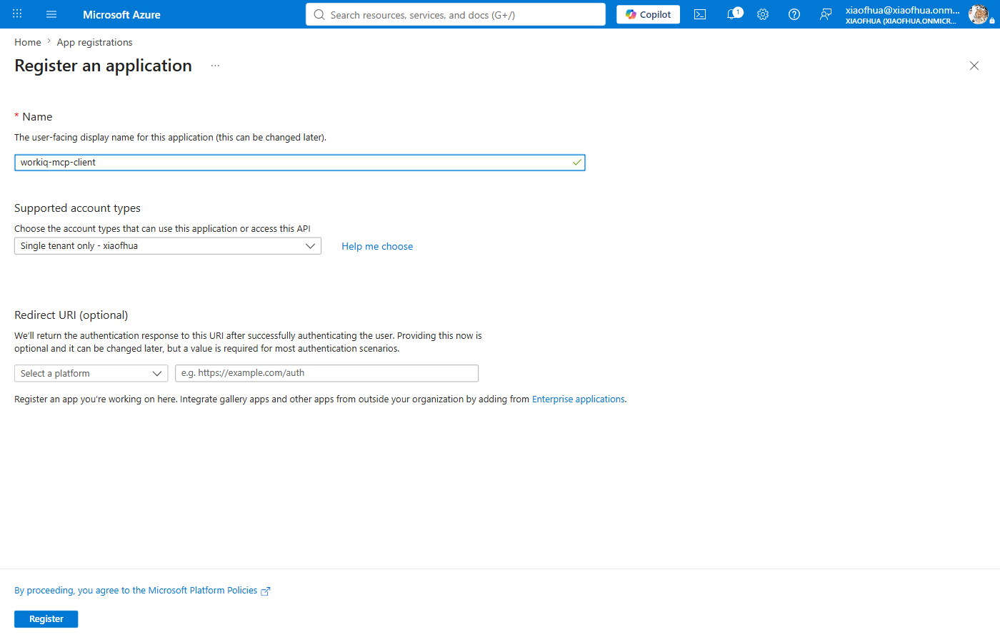
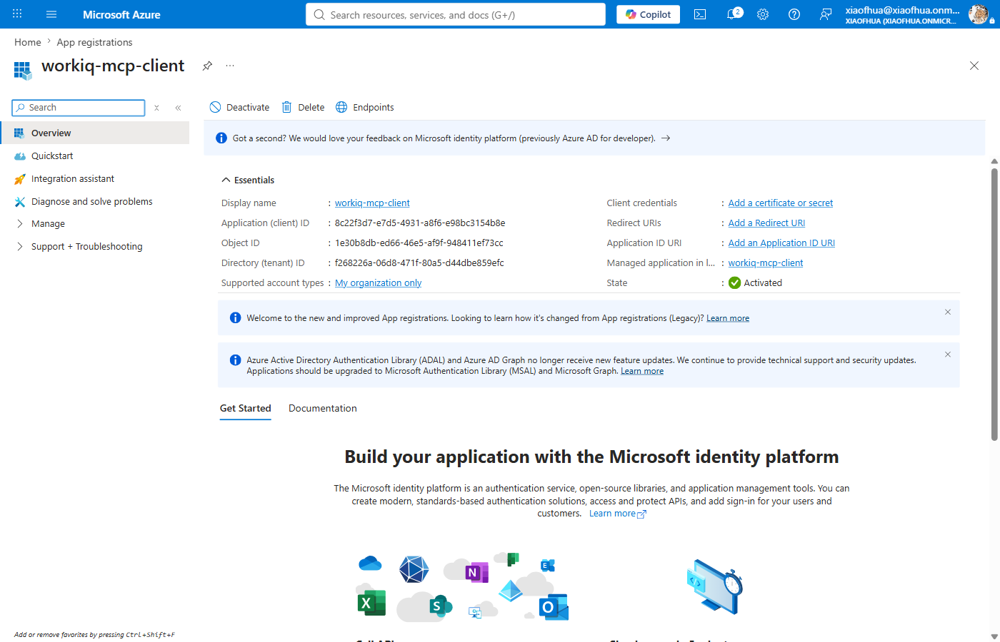
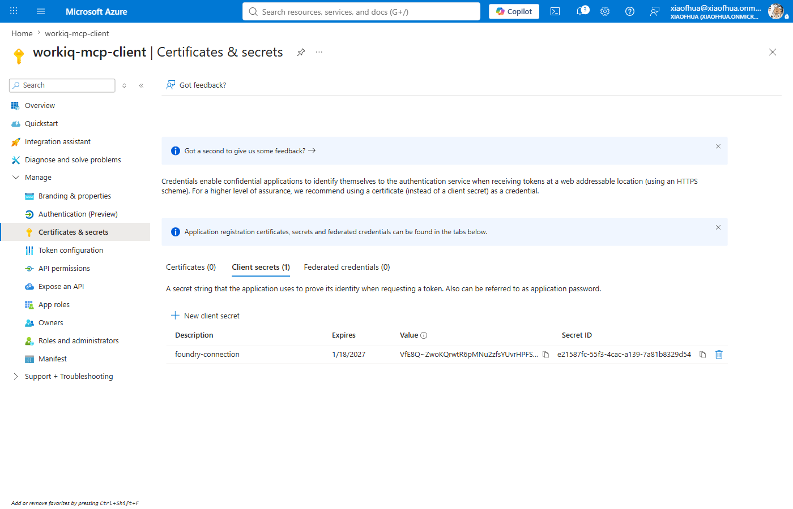
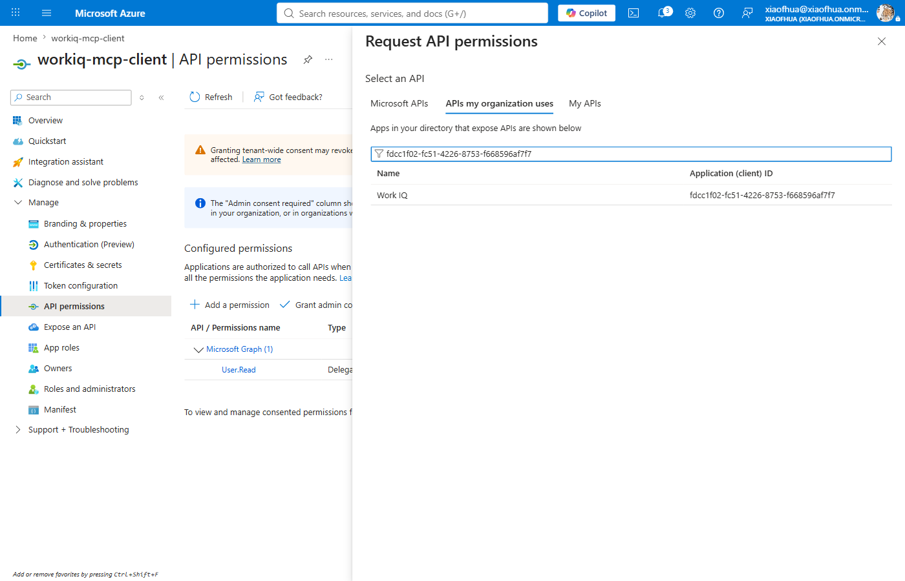
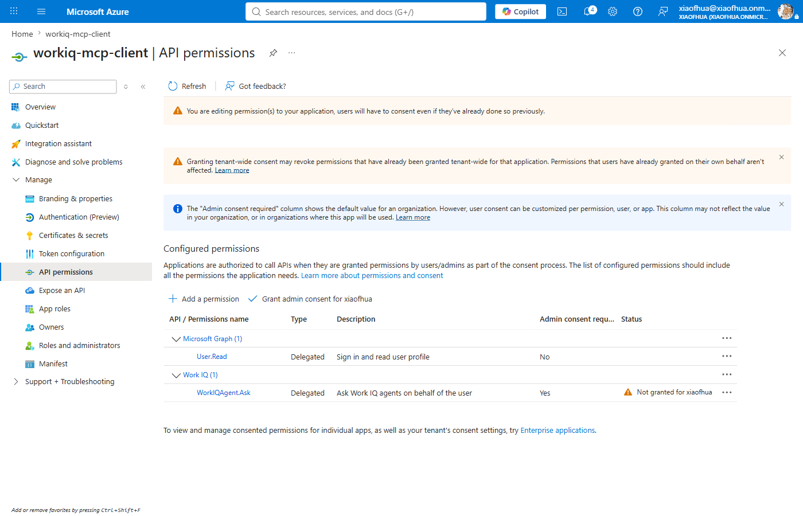
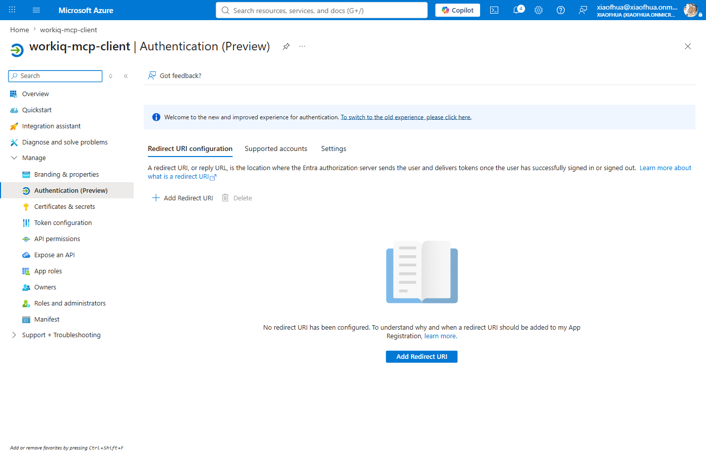
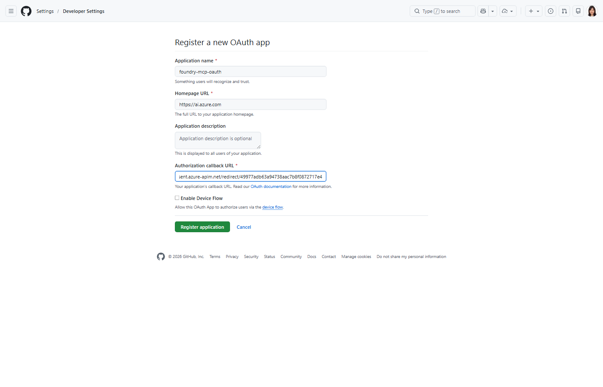

# MCP — OAuth Identity Passthrough (custom app)

Connect to an MCP server via OAuth2 using **your own app registration** (bring-your-own client ID
and secret). The first invocation triggers a consent flow.

**Example servers:** Work IQ
(`https://workiq.svc.cloud.microsoft/mcp`, first-party — [Option A](#option-a--first-party-microsoft-entra-app)),
GitHub (`https://api.githubcopilot.com/mcp`, third-party — [Option B](#option-b--third-party-oauth-app-eg-github)).

> **How this differs from the other passthrough modes.** All three run the tool as the signed-in
> **user**; they differ in the OAuth app and consent:
> - **Custom OAuth passthrough** *(this page)* — You register your own OAuth app. User consents on first use. Works with any server, including non-catalog.
> - **[Managed OAuth passthrough](mcp-oauth-managed.md)** — No OAuth app to set up (Foundry uses its own). User consents on first use. Only some catalog MCP support it.
> - **[User Entra Token](mcp-user-entra-token.md)** — No OAuth app to set up (Foundry uses its own). No user consent needed. Only some catalog MCP support it.

---

## Prerequisites — register the OAuth app

Bring your own OAuth app. Where you register it depends on **who owns the MCP server's identity**.
Both paths produce the same five inputs — **Client ID**, **Client secret**, **Auth URL**,
**Token URL**, **Scopes** — which you fill into whichever surface you use below.

| Your MCP is… | Register the OAuth app with… | Follow |
|---|---|---|
| **First-party** — an Azure-hosted MCP you build (e.g. on Azure Functions), or any server behind Microsoft Entra (e.g. Work IQ, `https://workiq.svc.cloud.microsoft/mcp`) | **Microsoft Entra ID** | [Option A](#option-a--first-party-microsoft-entra-app) |
| **Third-party** — a SaaS / partner / non-Azure MCP (e.g. GitHub) | **that provider's** identity system | [Option B](#option-b--third-party-oauth-app-eg-github) |

### Option A — First-party (Microsoft Entra app)

This walkthrough uses **Work IQ** (`https://workiq.svc.cloud.microsoft/mcp`), a Microsoft-published
MCP server, as the running example. The same steps apply to any Entra-backed MCP, including one you
build yourself (e.g. on Azure Functions) — for that server-side setup, see
[Configure Azure Functions MCP servers as Foundry tools](https://learn.microsoft.com/en-us/azure/azure-functions/functions-mcp-foundry-tools?tabs=unauthenticated%2Cfoundry).

For OAuth passthrough you need a **client app** that Foundry uses to run the OAuth sign-in — its
**Client ID** and **Client secret** go into the connection. That's the app you register here.

You also need the MCP server's **API scope** for the **Scopes** field. This scope usually already
exists — a published first-party MCP server (like Work IQ) or your own MCP server's registration
already exposes it; you just grant your client app permission to it. Only create an API app yourself
if your MCP server has no registration yet (see [No API app yet?](#no-api-app-yet) below).

1. In the [Azure portal](https://portal.azure.com/), open **Microsoft Entra ID** → **App
   registrations** → **New registration**. Name it (e.g. `workiq-mcp-client`) and register.

   
2. On the **Overview**, copy the **Application (client) ID** and **Directory (tenant) ID**.

   
3. Under **Certificates & secrets** → **Client secrets** → **New client secret**, create one and
   copy its **Value** immediately.

   
4. Under **API permissions** → **Add a permission**, select the MCP server's API and add its scope.
   For **your own** API, it's under **My APIs**. For a published server like Work IQ, use **APIs my
   organization uses** and **search by the API's application ID** (e.g.
   `fdcc1f02-fc51-4226-8753-f668596af7f7`) — a published MCP server's API often isn't provisioned in
   your tenant yet, so a name search returns nothing while the **ID** resolves it. Then pick the
   delegated scope (`WorkIQAgent.Ask` here; `user_impersonation` for your own API) and **Add
   permissions**.

   
   

5. Leave **Authentication** → **Redirect URIs** empty for now — you'll add Foundry's generated reply
   URL after the connection exists (see [Register Foundry's reply URL](#register-foundrys-reply-url)).

   

| Input | Value (Work IQ example) |
|-------|-------|
| **Client ID** | the client app's **Application (client) ID** |
| **Client secret** | the secret **Value** from step 3 |
| **Auth URL** | `https://login.microsoftonline.com/<tenant-id>/oauth2/v2.0/authorize` |
| **Token URL** | `https://login.microsoftonline.com/<tenant-id>/oauth2/v2.0/token` |
| **Refresh URL** *(optional)* | `https://login.microsoftonline.com/<tenant-id>/oauth2/v2.0/token` |
| **Scopes** | `fdcc1f02-fc51-4226-8753-f668596af7f7/WorkIQAgent.Ask offline_access` (for your own API: `api://<api-client-id>/user_impersonation offline_access`) |

#### Scopes

**Find the scope from the server:**
- An MCP server advertises its required audience and scope in its OAuth metadata. Probe the resource-metadata endpoint (a `401` from the server returns a
`WWW-Authenticate` header pointing at it) and read `scopes_supported`:

   ```bash
   curl -s https://workiq.svc.cloud.microsoft/.well-known/oauth-protected-resource/mcp | jq .
   # scopes_supported: ["fdcc1f02-fc51-4226-8753-f668596af7f7/WorkIQAgent.Ask"]
   # => API app (audience) = fdcc1f02-fc51-4226-8753-f668596af7f7, scope = WorkIQAgent.Ask
   ```

- For **your own** Azure Functions MCP, the scope is whatever you exposed on the API app (e.g.
`api://<api-client-id>/user_impersonation`).

**Format the `Scopes` value:**

- In the VS Code configuration field, separate multiple scopes with a single space.
- With `azd ai connection create`, repeat `--scopes` or use one comma-separated value.
- Append `offline_access` so Foundry can auto-refresh the token; without it, users re-consent when
  the access token expires.


<a id="no-api-app-yet"></a>

> **No API app yet?** If your MCP server has no registration (e.g. a brand-new Azure Functions MCP),
> you can reuse the **client app you created above** as the API app too — no second registration
> needed. On that app, go to **Expose an API** → set the **Application ID URI** (`api://<client-id>`)
> and add a `user_impersonation` scope, then grant the app permission to its own scope under **API
> permissions** → **My APIs**. The API and client IDs are then the same value, so use
> `api://<client-id>/user_impersonation offline_access` in **Scopes**.

<details>
<summary><b>Or do steps 1–4 with the Azure CLI (<code>az</code>)</b></summary>

Single-app variant for an MCP whose **API you own** (e.g. your own Azure Functions MCP) — the app is
both the OAuth client and its own API. Requires `az login`. For a published server like Work IQ,
whose API already exists, register only the client app (steps 1–2 below) and grant it the server's
scope instead of exposing your own (step 4 in the portal walkthrough above).

```bash
# 1. Register the app
APP_ID=$(az ad app create --display-name my-mcp-client --query appId -o tsv)
TENANT_ID=$(az account show --query tenantId -o tsv)

# 2. Add a client secret (copy the printed value — it's shown only once)
az ad app credential reset --id "$APP_ID" --display-name toolbox-oauth2 --years 1 --query password -o tsv

# 3. Expose an API: set the Application ID URI + a user_impersonation scope
SCOPE_ID=$(python -c "import uuid; print(uuid.uuid4())")   # any GUID; uuidgen also works
az ad app update --id "$APP_ID" --identifier-uris "api://$APP_ID"
az ad app update --id "$APP_ID" --set api="{\"oauth2PermissionScopes\":[{\"id\":\"$SCOPE_ID\",\"adminConsentDescription\":\"Access API as the signed-in user\",\"adminConsentDisplayName\":\"Access API as user\",\"userConsentDescription\":\"Access API on your behalf\",\"userConsentDisplayName\":\"Access API\",\"value\":\"user_impersonation\",\"type\":\"User\",\"isEnabled\":true}]}"

# 4. Grant the app permission to its own scope
az ad app permission add --id "$APP_ID" --api "$APP_ID" --api-permissions "$SCOPE_ID=Scope"

echo "Client ID : $APP_ID"
echo "Auth URL  : https://login.microsoftonline.com/$TENANT_ID/oauth2/v2.0/authorize"
echo "Token URL : https://login.microsoftonline.com/$TENANT_ID/oauth2/v2.0/token"
echo "Scopes    : api://$APP_ID/user_impersonation offline_access"
```

Leave redirect URIs unset — add Foundry's reply URL later
([Register Foundry's reply URL](#register-foundrys-reply-url)). For the two-app case, register a
separate API app and point `--api` in step 4 at **its** appId.
</details>

### Option B — Third-party OAuth app (e.g. GitHub)

Register the OAuth app with **that provider's** identity system, not Entra. Using a **GitHub OAuth
App** as the example:

1. Create the app at
   [github.com/settings/applications/new](https://github.com/settings/applications/new). Use any
   name/homepage URL; set **Authorization callback URL** to a placeholder — you'll replace it with
   Foundry's reply URL after the connection exists (see
   [Register Foundry's reply URL](#register-foundrys-reply-url)).

   
2. Copy the **Client ID** and **Generate a new client secret**.

| Input | GitHub OAuth App value |
|-------|------------------------|
| **Client ID** | the app's **Client ID** |
| **Client secret** | the generated **client secret** |
| **Auth URL** | `https://github.com/login/oauth/authorize` |
| **Token URL** | `https://github.com/login/oauth/access_token` |
| **Refresh URL** *(optional)* | `https://github.com/login/oauth/access_token` |
| **Scopes** | space-delimited scope(s) your MCP needs, e.g. `repo read:user` |

Any OAuth2 provider works the same — swap GitHub's endpoint URLs and scopes for yours.

---

## Create the tool connection & toolbox

### Foundry Toolkit in VS Code

1. Follow the README's [Create the toolbox](../README.md#create-the-toolbox) steps to open the config dialog — on the **Custom** tab, select **Model Context Protocol (MCP)** → **Create**.
2. Fill in the config dialog and click **Connect**:

   | Field | Value |
   |-------|-------|
   | **Authentication** | `OAuth 2.0` |
   | **OAuth Provider** | `Custom OAuth` |
   | **Client ID**, **Client secret**, **Auth URL**, **Token URL**, **Refresh URL** (optional), **Scopes** | from the [Prerequisites](#prerequisites--register-the-oauth-app) table |

3. On **Connect**, the **Tool Connected** dialog shows an **OAuth Redirect URL**. Copy it and register it on your OAuth app (see [Register Foundry's reply URL](#register-foundrys-reply-url)) — without this, consent fails with a `redirect_uri` mismatch.

### `azd` CLI

Create the connection once, then create the toolbox one of two ways:

- **Way A — standalone toolbox** (`azd ai toolbox create`): builds the toolbox on its own. Best for
  testing, or when the toolbox is shared across agents.
- **Way B — toolbox in an agent project** (`azure.yaml` + `azd deploy`): declares the toolbox next to
  your agent and ships them together. Best when the toolbox belongs to one agent project.

#### 1. Create the connection (both ways)

```bash
azd ai connection create workiqmcpoauth \
  --kind remote-tool \
  --target https://workiq.svc.cloud.microsoft/mcp \
  --auth-type oauth2 \
  --client-id "<your_client_id>" \
  --client-secret "<your_client_secret>" \
  --authorization-url "https://login.microsoftonline.com/<tenant-id>/oauth2/v2.0/authorize" \
  --token-url "https://login.microsoftonline.com/<tenant-id>/oauth2/v2.0/token" \
  --scopes "fdcc1f02-fc51-4226-8753-f668596af7f7/WorkIQAgent.Ask,offline_access" \
  --project-endpoint "$FOUNDRY_PROJECT_ENDPOINT"
```

> Client ID/secret come from your Entra client app (see
> [Prerequisites → Option A](#option-a--first-party-microsoft-entra-app)). Work IQ is a first-party
> Microsoft Entra MCP, so use the Entra authorize/token URLs and its advertised
> `fdcc1f02-fc51-4226-8753-f668596af7f7/WorkIQAgent.Ask` scope. For a
> third-party server, swap in that provider's URLs and scopes instead.

Foundry generates the per-connection **reply URL** as soon as the connection exists. `azd ai
connection show` doesn't surface it — read `properties.redirectUrl` from the ARM record, then
register it on your OAuth app (see [Register Foundry's reply URL](#register-foundrys-reply-url)):

```bash
az rest --method get --query "properties.redirectUrl" -o tsv \
  --url "https://management.azure.com/subscriptions/<sub>/resourceGroups/<rg>/providers/Microsoft.CognitiveServices/accounts/<account>/projects/<project>/connections/workiqmcpoauth?api-version=2025-06-01"
# => https://global.consent.azure-apim.net/redirect/<connector-guid>
```

#### Way A — standalone toolbox (`toolbox.yaml`)

1. Write `toolbox.yaml` referencing the connection by name:

   ```yaml
   # toolbox.yaml
   description: workiq-mcp-oauth-custom toolbox
   tools:
     - type: mcp
       server_label: workiq
       project_connection_id: workiqmcpoauth
       require_approval: "never"
   ```

2. Create the toolbox:

   ```bash
   azd ai toolbox create agent-tools --from-file ./toolbox.yaml --project-endpoint "$FOUNDRY_PROJECT_ENDPOINT"
   ```

3. Copy the versioned MCP endpoint it prints into your agent's `TOOLBOX_ENDPOINT`:

   ```bash
   azd env set TOOLBOX_ENDPOINT "https://<account>.services.ai.azure.com/api/projects/<project>/toolboxes/agent-tools/versions/1/mcp?api-version=v1"
   ```

#### Way B — toolbox in an agent project (`azure.yaml`)

1. Declare the toolbox and agent together in `azure.yaml`, referencing the connection by name:

   ```yaml
   # azure.yaml
   requiredVersions:
     azd: '>=1.27.1'
     extensions:
       azure.ai.agents: '>=1.0.0-beta.9'
   name: my-agent-project
   services:
     agent-tools:
       host: azure.ai.toolbox
       tools:
         - type: mcp
           server_label: workiq
           project_connection_id: workiqmcpoauth
     my-agent:
       host: azure.ai.agent
       uses:
         - agent-tools
       env:
         TOOLBOX_NAME: agent-tools
   ```

2. Deploy the toolbox (and agent):

   ```bash
   azd deploy agent-tools
   ```

3. No `TOOLBOX_ENDPOINT` needed — the agent resolves the toolbox from `TOOLBOX_NAME` at runtime.

---

## Register Foundry's reply URL

Foundry generates a **per-connection reply URL** when the connection is created (in VS Code it's
shown in the **Tool Connected** dialog; via CLI/portal, read it from the connection details).
Register that exact URL on the **same OAuth app** you used above, or consent fails with a
`redirect_uri` mismatch.

**First-party (Microsoft Entra app):** in the Azure portal, open the app's **Authentication** →
**Add a platform** → **Web**, paste the reply URL under **Redirect URIs**, and **Configure**.


Or with the Azure CLI:

```bash
az ad app update --id <APP_ID> --web-redirect-uris "<REPLY_URL>"
```

> `--web-redirect-uris` **replaces** the app's full Web redirect-URI list. If the app already has
> other Web redirect URIs to keep, pass them all in the same command (space-separated).

**Third-party (e.g. GitHub):** open the OAuth app's settings and replace the placeholder
**Authorization callback URL** (e.g. `https://example.com/placeholder` from
[Option B](#option-b--third-party-oauth-app-eg-github)) with Foundry's reply URL, then **Update
application**. Any provider works the same — set its allowed redirect/callback URI to Foundry's
reply URL.



---

## Notes

- The **first** invocation triggers OAuth consent — the tool call returns MCP code `-32006` with a
  consent URL. Complete consent, then retry.
- Use this when you need control over the OAuth app (scopes, tenant, branding). Otherwise prefer the
  [managed connector](mcp-oauth-managed.md), which requires no client credentials.

## References

- [MCP tool documentation](https://learn.microsoft.com/azure/foundry/agents/how-to/tools/model-context-protocol)
